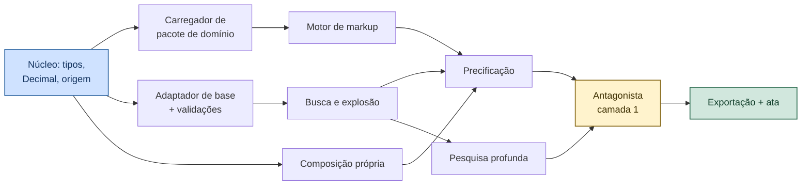
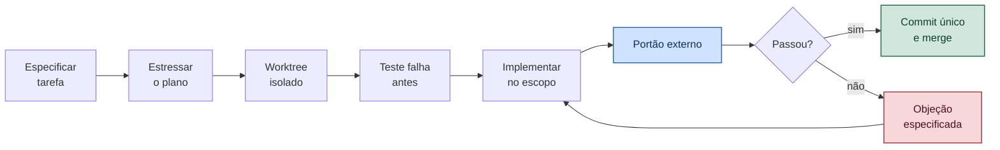

# VÉRTICE — AGENTS

Protocolo de construção por agentes de IA. Define como o repositório, as tarefas e a verificação são organizados para que a geração de código seja fluida e verificável.

**Versão:** 1.1
**Documento-pai:** `VERTICE-decisoes.md` — ADR-030
**Relacionado:** `VERTICE-REGRAS.md`, `VERTICE-LINT-SUITE.md`, `VERTICE-agente-antagonista.md`, `VERTICE-modulo-correct.md`

---

## 1. Princípio

> **O repositório é a interface do agente.**

Agente não lê a intenção de quem escreveu. Ele lê o que está no disco. Toda ambiguidade deixada na documentação vira decisão arbitrária no código — e decisão arbitrária de agente é rápida, plausível e silenciosa, que é a pior combinação.

Fluidez, aqui, não significa autonomia. Significa **eliminar a necessidade de o agente adivinhar**.

### 1.1 A descoberta que organiza tudo

A especificação de defeito do antagonista — alvo, evidência, comportamento atual, comportamento esperado, teste que reproduz, critério de pronto, escopo permitido — **já é um ticket de agente completo**.

Ela não foi desenhada para isso. Foi desenhada para que outro módulo consertasse sem reinvestigar. O requisito é o mesmo: quem executa não precisa entender o histórico, só o contrato.

Consequência prática: o conjunto documental do VÉRTICE já está pronto para construção por agente. Falta declarar o protocolo.

---

## 2. Unidade de trabalho

Nenhum agente recebe "implemente o módulo de precificação". Recebe **tarefa com contrato**, no mesmo formato da especificação de defeito:

```yaml
id: T-PRC-014
titulo: "Motor de markup a partir de expressão declarada em pacote"
contexto: [VERTICE-plataforma.md#ADR-019, VERTICE-modulo-precificacao.md#3]
escopo_permitido:
  - core/pricing/markup.py
  - tests/pricing/test_markup.py
entrada: "ParcelasMarkup + expressão declarativa do pacote de domínio"
saida: "Decimal com o percentual resultante"
criterio_de_pronto:
  - "tests/pricing/test_markup.py passa"
  - "âncora BDI do CME devolve 23,6245%"
  - "propriedade: tributos no denominador, nunca somados"
  - "ruff, mypy --strict e mutação acima de 80% no arquivo"
proibicoes:
  - "float em qualquer valor monetário ou percentual"
  - "constante numérica fora de constante nomeada"
  - "abstração nova sem segundo caso concreto"
dependencias: [T-NUC-003, T-DOM-007]
```

**Tarefa sem `criterio_de_pronto` verificável por comando não é despachada.** Se o pronto depende de julgamento humano, ela é de revisão, não de geração.

### 2.1 Granularidade

| Tamanho | Regra |
|---------|-------|
| Mínimo | Uma unidade coesa com teste próprio |
| Máximo | O que cabe em um worktree isolado sem tocar fronteira de outro módulo |
| Proibido | Tarefa que atravessa dois módulos — vira duas tarefas com dependência |

A fronteira de módulo é a mesma da §3.1 da arquitetura. Ela existe para humano e serve igual para agente.

---

## 3. Divisão de ferramentas

Você mencionou Muse Spark e Claude. A divisão abaixo parte do que cada um faz melhor, não de preferência.

| Etapa | Ferramenta | Por quê |
|-------|-----------|---------|
| Especificar tarefa a partir dos documentos | Claude | Trabalho de leitura longa e contrato preciso |
| Estressar o plano antes de executar | Muse Code `/grill` | Existe para submeter plano a pressão até ele se sustentar |
| Executar tarefas em paralelo | Muse Code, subagentes em worktrees isolados | Isolamento por worktree é exatamente o ponto de retorno do módulo Correct |
| Revisão adversarial da entrega | Claude | Portão G7, que é leitura crítica e não geração |
| Correção dentro de escopo | Qualquer um | O contrato é que governa, não a ferramenta |

### 3.1 `/grill` e o antagonista

O `/grill` do Muse Code submete o plano a estresse até ele se sustentar. É o mesmo papel do antagonista, aplicado ao plano em vez do artefato.

**Aproveitar sem duplicar:** `/grill` roda **antes** da execução, sobre o plano. O antagonista roda **depois**, sobre o resultado. Um não substitui o outro, e rodar os dois na mesma etapa é desperdício.

### 3.2 Log de eventos e retomada

O Muse Code mantém log local de cada chamada, execução e edição, o que torna a execução reexecutável e a retomada exata após falha.

Isso **alimenta diretamente** duas coisas que já estão especificadas: a tabela `rodada_correcao` do módulo Correct e o relatório de sessão da §7.1 das REGRAS. Não é para reimplementar — é para exportar.

### 3.3 Verificação independente

Regra que não muda com a ferramenta: **o agente não declara pronto; o portão declara.** A suíte de lint roda fora do processo do agente, sem que ele possa influenciar o resultado.

Um agente que roda o próprio teste e relata sucesso está validando o próprio trabalho — exatamente o que a §1 do antagonista proíbe.

---

## 4. Pacotes de contexto

Agente com repositório inteiro no contexto perde precisão e gasta caro. Cada módulo tem um pacote fechado:

```text
contexto/
├── nucleo.md            # invariantes que valem em toda tarefa
├── precificacao.md      # doc do módulo + interfaces vizinhas + âncoras
├── sinapi.md
├── cad.md
├── antagonista.md
├── pesquisa.md
└── dominio.md
```

Cada pacote contém: o documento do módulo, apenas as **assinaturas** dos módulos vizinhos, os testes-âncora aplicáveis e as proibições vigentes. Nunca o código dos vizinhos.

### 4.1 Invariantes, em toda tarefa

Doze linhas que entram em qualquer contexto, porque violá-las é erro em qualquer lugar do sistema:

1. Português em todo identificador, arquivo e comentário.
2. `Decimal` em valor monetário, percentual e coeficiente. `float` nunca.
3. Todo campo numérico carrega origem resolvível. Número mágico é rejeitado.
4. Quantidade vem da geometria ou de memória declarada.
5. Abstração só com segundo caso concreto.
6. Nada de número mágico no código: constante nomeada.
7. `except` sempre tipado, nunca silencioso.
8. Teste-âncora é intocável.
9. Uma tarefa, um commit.
10. Fora do escopo permitido, não toca.
11. Núcleo não conhece domínio: nem alvenaria, nem BDI, nem SINAPI.
12. Quem propõe não valida.

---

## 5. Ordem de construção

O grafo de dependências determina o que roda em paralelo. Tarefas na mesma faixa são independentes.



| Faixa | Paralelizável | Bloqueia |
|-------|---------------|----------|
| 1 | Núcleo de tipos e origem | Tudo |
| 2 | Carregador de pacote · Adaptador de base · Composição própria | Faixa 3 |
| 3 | Motor de markup · Busca e explosão · Pesquisa | Precificação |
| 4 | Precificação | Antagonista |
| 5 | Antagonista camada 1 | Exportação |
| 6 | Exportação e ata | — |

**A faixa 1 não é paralelizável e é a mais importante.** `Decimal` e campo de origem obrigatório nascem ali. Retrofit disso depois toca todo arquivo do sistema.

---

## 6. Anti-padrões de agente

Cada um com a detecção que o pega. Detecção sem consequência é decoração.

| Anti-padrão | Por que acontece | Detecção |
|-------------|------------------|----------|
| Alterar teste para fazê-lo passar | Caminho de menor resistência | Arquivo de teste modificado na rodada é divergência imediata |
| Ampliar escopo por conveniência | "Já que estou aqui" | Diff fora do `escopo_permitido` é rejeitado |
| Inventar número plausível | Preencher lacuna parece útil | `id_origem` obrigatório; lint `VD-03` |
| Criar abstração especulativa | Padrão aprendido em código de biblioteca | Objeção `A-DEV-11` |
| Declarar pronto sem evidência | Otimismo de relatório | Portão externo ao agente |
| Introduzir `float` em dinheiro | Padrão dominante na linguagem | Lint `VD-01` |
| Escrever identificador em inglês | Padrão dominante no treino | Lint `VD-02` |
| Silenciar erro para o teste passar | Remove sintoma | Lint `VD-04` |

Os três últimos são os mais frequentes, porque contrariam o hábito estatístico do modelo. É por isso que estão nos invariantes de contexto **e** no lint: instrução sozinha não segura padrão dominante.

---

## 7. Fluxo de uma tarefa



O laço `O → I` obedece aos detectores de divergência do módulo Correct: cinco rodadas no máximo, retorno ao estado estável e reclassificação como utopia se não convergir. **Agente em laço infinito é o modo de falha mais caro que existe**, porque ele não cansa.

---

## 8. Encerramento de estágio

Sem mudança em relação ao que já está escrito: suíte completa, testes-âncora, revisão adversarial conduzida por quem não implementou, relatório de sessão, documentos atualizados.

Um acréscimo para trabalho com agente:

**Auditoria de proveniência.** Ao fim do estágio, varrer todo campo numérico persistido e verificar que a cadeia de origem resolve. Campo órfão indica número que entrou sem passar pela regra — e agente é o vetor mais provável, porque ele preenche lacuna com naturalidade.

---

## 9. Testes de aceite

| # | Cenário | Esperado |
|---|---------|----------|
| A01 | Tarefa sem critério verificável por comando | Não despachada |
| A02 | Agente modifica arquivo de teste na rodada | Divergência imediata |
| A03 | Diff fora do escopo permitido | Rejeitado no merge |
| A04 | Duas tarefas independentes | Executam em paralelo sem conflito de merge |
| A05 | Tarefa atravessando dois módulos | Recusada; vira duas com dependência |
| A06 | Agente declara pronto com portão reprovado | Portão prevalece |
| A07 | Valor numérico sem `id_origem` | Bloqueado na persistência |
| A08 | Laço de correção na sexta rodada | Divergência declarada |
| A09 | Log de eventos do agente | Exportável para `rodada_correcao` e relatório |
| A10 | Pacote de contexto de um módulo | Suficiente para a tarefa, sem o código dos vizinhos |
| A11 | Auditoria de proveniência no fim do estágio | Zero campo numérico órfão |
| A12 | Identificador em inglês gerado | Lint `VD-02` acusa |

---

## 10. Histórico

| Versão | Data | Alteração |
|--------|------|-----------|
| 1.1 | 13/09/2026 | Caminhos de exemplo atualizados para inglês (`core/`, `tests/`), acompanhando o rename retroativo de arquivos e pastas do código |
| 1.0 | 13/09/2026 | Documento inicial. Tarefa com contrato no formato da especificação de defeito. Divisão de ferramentas, pacotes de contexto, grafo de construção, anti-padrões com detecção e auditoria de proveniência no encerramento |
