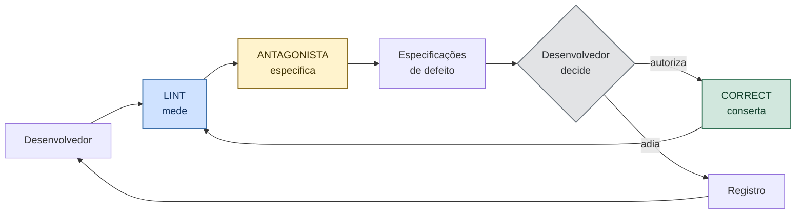
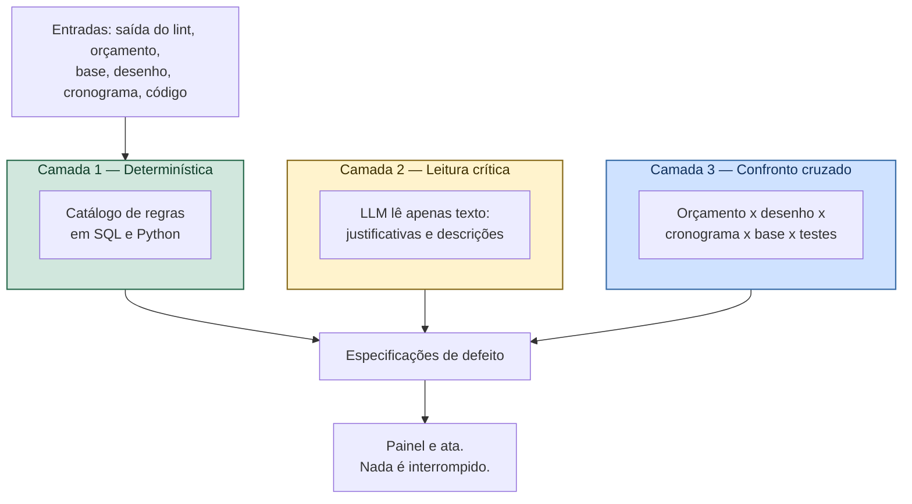
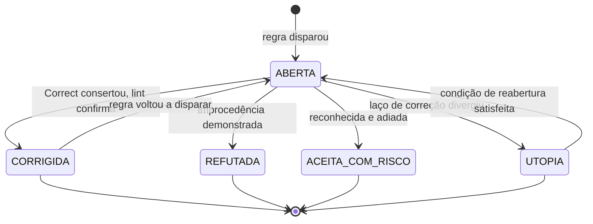

# VÉRTICE — Agente Antagonista

**Versão:** 0.5
**Documento-pai:** `VERTICE-decisoes.md` — ADR-011 e ADR-012
**Relacionado:** `VERTICE-modulo-correct.md`, `VERTICE-LINT-SUITE.md`, `VERTICE-REGRAS.md`

---

## 1. Princípio

> **Quem propõe não valida. Quem valida não corrige. Nada trava.**

Três papéis separados no desenvolvimento — lint mede, antagonista especifica, Correct conserta — e um quarto, o desenvolvedor, que decide. Nenhum acumula dois.

E o antagonista **nunca interrompe o trabalho**. Ele não reprova, não bloqueia, não impede commit nem execução. Ele produz **especificação de defeito**: o que está errado, onde exatamente, por quê, e como saber que foi resolvido.

A razão é prática. Ferramenta que trava vira ferramenta que se desliga. Um antagonista que impede o desenvolvedor de seguir será contornado na primeira sexta-feira de prazo apertado, e a partir daí não existe mais. Um antagonista que apenas especifica com precisão continua sendo lido, porque poupa trabalho em vez de criar.

### 1.0 Direção

O antagonista é responsável pela **direção** da verificação: é ele quem decide o que precisa ser pesquisado mais fundo e o que precisa ser validado de novo. A IA de classificação e a pesquisa profunda são executoras; ele é quem manda.

Concretamente, ele **força**:

- pesquisa profunda quando um item não tem cobertura provada na base;
- o esgotamento das sete passadas antes de qualquer CPU (`VERTICE-modulo-cpu.md` §3);
- revalidação de todo achado cuja fonte tenha mais de 90 dias;
- nova rodada de busca quando a justificativa de rejeição de um candidato não se sustenta.

Ele dirige, não executa. Dirigir sem escrever é o que preserva a independência.

### 1.1 O que ele é

Um auditor simulado, em dois domínios:

- **Produto:** o que um analista de tribunal de contas apontaria neste orçamento.
- **Desenvolvimento:** o que está quebrado neste código, com precisão suficiente para outro módulo consertar sem investigar de novo.

### 1.2 O que ele não é

- Não corrige. Não edita orçamento, não edita código.
- Não aprova. Ausência de objeção não é selo de correção.
- Não bloqueia. Nem exportação, nem commit, nem encerramento de estágio.
- **Não produz número mágico.** Toda afirmação numérica que ele faz cita a origem que a sustenta.
- Não escolhe o que consertar. Essa decisão é do desenvolvedor ou do responsável técnico.

---


## 2. O laço de desenvolvimento



O lint não conversa com o Correct. Tudo passa pelo antagonista, porque saída de lint é achado bruto — "linha 214, complexidade 14" — e o Correct precisa de especificação, não de achado.

O antagonista é o tradutor: recebe achado de ferramenta, cruza com o contexto do projeto e devolve defeito especificado. É aí que ele agrega o que nenhum linter agrega: saber que a complexidade 14 está no cálculo de BDI, que existe teste-âncora cobrindo aquilo, e que o escopo de correção permitido é uma função só.

### 2.1 As quatro saídas

Toda objeção termina em um de quatro estados. **Sempre existe pelo menos um disponível**, o que torna impossível ficar preso:

| Saída | Quando | Quem decide |
|-------|--------|-------------|
| `CORRIGIDA` | O defeito foi consertado e a verificação não dispara mais | Correct executa, lint confirma |
| `REFUTADA` | A objeção é improcedente, com motivo escrito | Desenvolvedor |
| `ACEITA_COM_RISCO` | Procede, mas não será tratada agora, conscientemente | Desenvolvedor |
| `UTOPIA` | Corrigir gera divergência: o conserto custa mais do que o sistema comporta | Detectado pelo Correct, confirmado pelo desenvolvedor |

Não existe estado "bloqueado". Não existe objeção sem caminho.

---

## 3. Especificação de defeito

Formato único de saída. Achado que não preencher todos os campos **não é publicado** — objeção vaga é ruído, e ruído treina o desenvolvedor a ignorar o antagonista.

```yaml
codigo_regra: A-EST-04
severidade: CRITICA
origem: [lint:ruff, regra_dominio]
alvo:
  tipo: CENARIO
  identificador: "sensibilidade.cenario_semicriticos"
  local: "core/pricing/sensibilidade.py:88"
comportamento_atual: >
  O cenário calcula o rodapé por fórmula própria, referenciando
  a composição de limpeza.
comportamento_esperado: >
  O cenário delega ao mesmo motor do orçamento oficial, sem
  fórmula paralela.
evidencia: >
  31,12 m x R$ 614,88 (CPU-LIMP) em vez de R$ 109,73 (CPU-ROD-01).
  Diferença de R$ 15.720,14 no cenário.
teste_que_reproduz: "tests/pricing/test_sensibilidade.py::test_cenario_usa_motor_oficial"
criterio_de_pronto: "O teste passa e a regra A-EST-04 deixa de disparar"
escopo_permitido: ["core/pricing/sensibilidade.py"]
custo_estimado: BAIXO
```

Três campos fazem a diferença entre especificação e reclamação:

- **`teste_que_reproduz`** — sem teste que falha antes, não há como provar que foi corrigido depois. Se o antagonista não consegue apontar ou gerar o teste, a objeção sai como severidade menor, marcada como não verificável.
- **`escopo_permitido`** — a fronteira que o Correct não atravessa. É o que impede que uma correção pontual vire refatoração de três dias.
- **`custo_estimado`** — insumo da decisão do desenvolvedor e sinal precoce de utopia. Custo alto em severidade baixa é candidato natural.

---

## 4. Arquitetura em três camadas

Fazer disso "um agente de IA que revisa" produziria objeção alucinada, que é pior que objeção nenhuma: consome atenção e ensina a ignorar o alerta.



**Camada 1** concentra a maior parte do valor e não usa IA. Regras executáveis, resultado reprodutível, execução abaixo de um segundo. Funciona no modo sem rede.

**Camada 2** entra num escopo estreito: ler texto e apontar fragilidade argumentativa. Justificativa de CPU que não explica por que o SINAPI não serve. Comentário de código que descreve o quê em vez do porquê. Entrada e saída só com texto; nenhum número atravessa.

**Camada 3** compara fontes que deveriam concordar: quantitativo contra desenho, duração do cronograma contra administração local, implementação contra especificação.

---

## 5. Catálogo de regras — produto

Cada regra tem código, severidade, evidência obrigatória e critério de pronto. As marcadas com ✓ nasceram de erro real encontrado na auditoria da planilha do CME.

### 5.1 Integridade estrutural

| Código | Objeção | Sev. | |
|--------|---------|------|---|
| `A-EST-01` | Fórmula referencia célula ou item vazio | Crítica | ✓ |
| `A-EST-02` | Total declarado difere da soma das linhas | Crítica | ✓ |
| `A-EST-03` | Conferência auto-referente: os dois lados leem a mesma origem | Crítica | ✓ |
| `A-EST-04` | Cenário calculado por fórmula paralela ao motor oficial | Crítica | ✓ |
| `A-EST-05` | Item de grupo incompleto em relação à EAP | Alta | ✓ |

> `A-EST-03` é a regra mais importante do catálogo. Na planilha auditada, o quadro de conferência comparava o total com ele mesmo e retornava aprovação sempre, inclusive se tudo estivesse errado. Verificação que não pode falhar não é verificação.

### 5.2 Duplicidade

| Código | Objeção | Sev. | |
|--------|---------|------|---|
| `A-DUP-01` | Insumo consumido em CPU ativa também aparece como linha da EAP | Crítica | ✓ |
| `A-DUP-02` | Duas composições cobrem o mesmo serviço na mesma área | Alta | |
| `A-DUP-03` | Serviço já embutido em composição aparece isolado | Alta | ✓ |
| `A-DUP-04` | Transporte de entulho contado na demolição e no grupo de resíduos | Alta | |

### 5.3 Base SINAPI

| Código | Objeção | Sev. | |
|--------|---------|------|---|
| `A-SIN-01` | Código desativado ou suspenso em uso | Crítica | |
| `A-SIN-02` | Código com alteração de unidade após a data-base | Crítica | |
| `A-SIN-03` | Não equivalência apoiada em código cuja descrição mudou depois | Alta | ✓ |
| `A-SIN-04` | Regimes misturados no mesmo orçamento | Crítica | |
| `A-SIN-05` | Datas-base diferentes entre itens | Alta | |
| `A-SIN-06` | Descrição no orçamento diverge da descrição oficial | Média | |
| `A-SIN-07` | Item com %AS relevante sem menção nas premissas | Baixa | |

### 5.4 Composições próprias

| Código | Objeção | Sev. | |
|--------|---------|------|---|
| `A-CPU-01` | CPU ativa sem justificativa técnica escrita | Crítica | |
| `A-CPU-02` | Componente sem fonte vinculada | Crítica | |
| `A-CPU-03` | CPU sustentada exclusivamente por fonte comercial | Alta | ✓ |
| `A-CPU-04` | Composição aderente não confrontada antes da criação | Alta | |
| `A-CPU-08` | CPU criada sem registro de esgotamento em sete passadas | Crítica | |
| `A-CPU-09` | Esgotamento sem confirmação por par registrada | Crítica | |
| `A-CPU-10` | Candidato rejeitado com justificativa que não sustenta a rejeição | Alta | |
| `A-CPU-11` | Pesquisa por pares indica código aderente amplamente usado para o serviço | Alta | |
| `A-CPU-05` | CPU provisória quando a base já publica preço na UF | Alta | ✓ |
| `A-CPU-06` | Percentual do custo direto em CPU acima da faixa | Média | |
| `A-CPU-07` | CPU reutilizada com data-base anterior à do orçamento | Alta | |

### 5.5 Precificação

| Código | Objeção | Sev. | |
|--------|---------|------|---|
| `A-BDI-01` | BDI acima do 3º quartil do TCU sem justificativa | Alta | |
| `A-BDI-02` | CPRB maior que zero em orçamento onerado | Crítica | |
| `A-BDI-03` | Parcela de BDI sem fonte declarada | Alta | |
| `A-BDI-04` | ISS sem município e base de cálculo declarados | Alta | |
| `A-AL-01` | Administração local zerada sem justificativa | Alta | ✓ |
| `A-AL-02` | Administração local embutida como percentual no BDI | Crítica | |
| `A-AL-03` | Duração da AL incoerente com o cronograma | Alta | |
| `A-TAX-01` | Taxa "a confirmar" somando ao total | Crítica | |
| `A-RES-01` | Fator de empolamento igual a 1,00 em demolição | Média | |
| `A-RES-02` | Caçambas sem arredondamento para cima | Média | |

### 5.6 Quantitativos

| Código | Objeção | Sev. | |
|--------|---------|------|---|
| `A-QNT-01` | Quantidade sem vínculo com desenho nem memória de cálculo | Crítica | |
| `A-QNT-02` | Escala do desenho não confirmada pelo RT | Crítica | |
| `A-QNT-03` | Áreas de piso e teto divergem além da tolerância sem justificativa | Alta | |
| `A-QNT-04` | Perímetro de rodapé incompatível com a área do ambiente | Alta | |
| `A-QNT-05` | Contagem de portas diverge dos blocos do desenho | Alta | |
| `A-QNT-06` | Revestimento sem item de preparo de base correspondente | Média | |

### 5.7 Escopo e rastreabilidade

| Código | Objeção | Sev. | |
|--------|---------|------|---|
| `A-PEN-01` | Pendência sem responsável nomeado | Alta | |
| `A-PEN-02` | Valor informativo de pendência somado ao total | Crítica | |
| `A-ESC-01` | Serviço citado no memorial e ausente do orçamento | Alta | |
| `A-ESC-02` | Item do orçamento sem respaldo em projeto ou memorial | Alta | |
| `A-FON-01` | Item sem fonte | Crítica | |
| `A-FON-02` | Fonte sem data-base | Alta | |
| `A-FON-03` | Fonte com URL e sem data de consulta | Média | |

---

## 6. Catálogo de regras — desenvolvimento

Traduzem achado de lint em defeito especificado. A coluna de origem indica qual ferramenta alimenta a regra.

| Código | Objeção | Origem | Sev. |
|--------|---------|--------|------|
| `A-DEV-01` | Valor monetário ou coeficiente em `float` | `VD-01` | Crítica |
| `A-DEV-02` | Identificador fora do português | `VD-02` | Média |
| `A-DEV-03` | Número mágico em regra de domínio | `VD-03` | Alta |
| `A-DEV-04` | `except` sem tipo ou que engole erro | `VD-04` | Alta |
| `A-DEV-05` | Chamada a provedor de IA fora dos módulos permitidos | `VD-05` | Crítica |
| `A-DEV-06` | Escrita no banco a partir do módulo antagonista | `VD-06` | Crítica |
| `A-DEV-07` | Teste sem asserção ou dependente de ordem | `G4` | Alta |
| `A-DEV-08` | Teste-âncora com valor divergente | `G4` | Crítica |
| `A-DEV-09` | Cobertura do núcleo de domínio abaixo do mínimo | `G4` | Alta |
| `A-DEV-10` | Regressão de desempenho acima de 20% | `G5` | Alta |
| `A-DEV-11` | Abstração introduzida com um único caso concreto | revisão | Média |
| `A-DEV-12` | Implementação divergente da especificação sem registro | `G7` | Alta |
| `A-DEV-13` | Segredo versionado | `G0` | Crítica |
| `A-DEV-14` | Nó Mermaid sem contraste explícito | `VM-08` | Baixa |
| `A-DEV-15` | Documento desatualizado em relação ao código do estágio | `G3` | Média |

---

## 7. Ata de objeções

```sql
CREATE TABLE objecao (
    id              INTEGER PRIMARY KEY,
    dominio         TEXT NOT NULL CHECK (dominio IN ('PRODUTO','DESENVOLVIMENTO')),
    id_alvo         TEXT NOT NULL,
    codigo_regra    TEXT NOT NULL,
    severidade      TEXT NOT NULL CHECK (severidade IN ('CRITICA','ALTA','MEDIA','BAIXA')),
    camada          INTEGER NOT NULL CHECK (camada IN (1,2,3)),
    especificacao   TEXT NOT NULL,   -- YAML da §3
    detectada_em    TEXT NOT NULL,
    rodada          INTEGER NOT NULL DEFAULT 1,
    situacao        TEXT NOT NULL CHECK (situacao IN
                       ('ABERTA','CORRIGIDA','REFUTADA','ACEITA_COM_RISCO','UTOPIA')),
    resposta        TEXT,
    respondida_em   TEXT,
    respondida_por  TEXT,
    id_utopia       INTEGER REFERENCES utopia(id)
);
```

O campo `rodada` é o que permite detectar divergência: objeção que reaparece na terceira rodada é candidata a utopia (`VERTICE-modulo-correct.md` §4).

### 7.1 Ciclo de vida



### 7.2 No produto: exige resposta, não impede

Objeção crítica sobre um orçamento **exige resposta escrita antes da exportação** — mas a resposta pode ser refutação. O RT escreve por que é improcedente e segue. O texto vai para a ata e para o documento exportado.

Isso não é travamento: é a diferença entre exigir consciência e impedir o trabalho. Bloquear sem saída faria o engenheiro procurar como desligar o recurso.

### 7.3 A ata vai junto com o orçamento

O documento exportado leva, ao final, o quadro de objeções e as respostas do RT. Um orçamento que já responde às perguntas que o analista faria chega ao tribunal em outra posição. O antagonista deixa de ser controle interno e vira peça de defesa.

---

## 8. Quando ele roda

| Momento | Domínio | Camadas | Comportamento |
|---------|---------|---------|---------------|
| Após cada execução do lint | Desenvolvimento | 1, 2 e 3 | Traduz achados em especificações |
| A cada edição de item | Produto | 1 | Silencioso, acumula no painel |
| Ao ativar uma CPU | Produto | 1 e 2 | Avisa; não impede |
| Ao importar nova base | Produto | 1 | Reavalia orçamentos abertos |
| Ao concluir a quantificação | Produto | 1 e 3 | Confronto com o desenho |
| Antes de exportar | Produto | 1, 2 e 3 | Completo; crítica exige resposta escrita |
| Sob demanda | Ambos | 1, 2 e 3 | "Simular auditoria" |

---

## 9. Limites duros

1. **Nenhuma escrita.** Acesso somente leitura ao banco e ao código, garantido por conexão distinta. Antagonista que corrige vira co-autor e perde independência.
2. **Nenhum número sem origem na saída da Camada 2.** O validador rejeita valor cuja cadeia de proveniência não resolva.

2.1. **Validação de achado de pesquisa.** O antagonista julga todo valor vindo de pesquisa antes de ele virar dado: corroboração, unidade, ordem de grandeza, moeda, data-base e documento que o sustenta. Ele **julga, não escreve** — o veredito volta ao módulo de ingestão, que aplica. A independência do auditor é preservada.
3. **Toda objeção carrega evidência apontável.** Sem alvo específico, não é exibida.
4. **Toda objeção carrega critério de pronto.** Sem ele, não há como o Correct provar conclusão.
5. **Silêncio não é aprovação.** A ata declara que ausência de objeção significa apenas que as regras catalogadas não dispararam.
6. **A Camada 1 não depende de rede.**
7. **Nunca interrompe execução, commit ou encerramento de estágio.**

---

## 10. Testes de aceite

| # | Cenário | Esperado |
|---|---------|----------|
| X01 | Orçamento do CME reconstruído, íntegro | Nenhuma objeção crítica |
| X02 | Cenário com fórmula paralela | `A-EST-04` com item exato e teste que reproduz |
| X03 | Conferência auto-referente | `A-EST-03` |
| X04 | Item de grupo incompleto em R$ 90,53 | `A-EST-02` e `A-EST-05` |
| X05 | Insumo de CPU também na EAP | `A-DUP-01`; avisa sem impedir |
| X06 | CPU ativada sem justificativa | `A-CPU-01`; avisa sem impedir |
| X07 | Nova base publica preço para CPU provisória | `A-CPU-05` na importação |
| X08 | CPRB positivo em orçamento onerado | `A-BDI-02` crítica |
| X09 | LLM devolve valor sem origem resolvível | Rejeitado pelo validador |
| X09b | Achado de pesquisa com origem completa | Aprovado pelo antagonista e disponibilizado para confirmação do RT |
| X10 | Achado de lint sem teste que reproduza | Publicado com severidade reduzida e marca de não verificável |
| X11 | Especificação com campo faltando | Não publicada |
| X12 | Orçamento sem objeção | Ata declara que silêncio não é aprovação |
| X13 | Mesma entrada duas vezes | Objeções idênticas: Camada 1 é determinística |
| X14 | Objeção em `UTOPIA` | Não é reemitida enquanto a condição de reabertura não ocorrer |
| X15 | Modo sem IA | Camadas 1 e 3 funcionam normalmente |

---

## 11. Histórico

| Versão | Data | Alteração |
|--------|------|-----------|
| 0.5 | 13/09/2026 | Caminhos de exemplo (YAML de especificação de defeito) atualizados para inglês, acompanhando o rename retroativo de arquivos e pastas do código |
| 0.1 | 13/09/2026 | Documento inicial. Catálogo de 45 regras, 11 derivadas de erros reais. Separação de papéis |
| 0.4 | 13/09/2026 | Papel de direção formalizado. Regras `A-CPU-08` a `A-CPU-11` sobre esgotamento e confirmação por par |
| 0.3 | 13/09/2026 | Regra numérica alinhada à cadeia de proveniência. Antagonista ganha papel de validador de achado de pesquisa, julgando sem escrever |
| 0.2 | 13/09/2026 | O antagonista deixa de bloquear qualquer etapa e passa a produzir especificação de defeito em formato fixo. Laço lint → antagonista → Correct formalizado. Estado `UTOPIA` criado como quarta saída. Catálogo `A-DEV-01` a `A-DEV-15` para o domínio de desenvolvimento |
