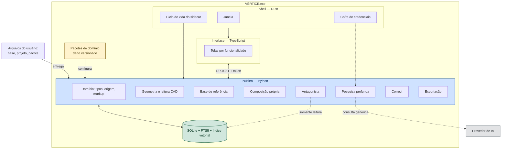
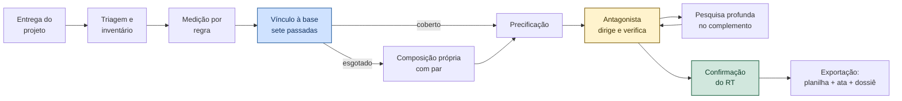

# VÉRTICE — Arquitetura

**Versão:** 1.2
**Status:** planejamento concluído — pronto para a F0
**Data:** 13/09/2026

Este documento descreve a estrutura estável do sistema. Decisões e sua justificativa estão em `VERTICE-decisoes.md`; a base acadêmica, em `VERTICE-fundamentos.md`. Aqui fica apenas o que muda pouco.

---

## 0. Conjunto documental

| Camada | Documento | Conteúdo |
|--------|-----------|----------|
| **Fundação** | `VERTICE-fundamentos.md` | Hierarquia de evidência, referência por problema, linguagem por paradigma |
| | `VERTICE-decisoes.md` | ADR-001 a ADR-034, com gatilho de revisão |
| | `VERTICE-arquitetura.md` *(este)* | Estrutura, módulos, contratos, operação |
| **Plataforma** | `VERTICE-plataforma.md` | Núcleo neutro e pacotes de domínio |
| | `VERTICE-modelo-universal.md` | Modelo de projeto, regras de medição, classificação |
| **Módulos** | `VERTICE-modulo-sinapi.md` | Adaptador da base, importação, ciclo mensal |
| | `VERTICE-modulo-precificacao.md` | Markup, administração local, taxas, resíduos, cronograma |
| | `VERTICE-modulo-cpu.md` | Esgotamento da base e composição própria |
| | `VERTICE-modulo-pesquisa.md` | Pesquisa profunda e dossiê |
| | `VERTICE-entrega-cad.md` | Requisitos de entrada geométrica |
| **Verificação** | `VERTICE-agente-antagonista.md` | Direção, regras, especificação de defeito |
| | `VERTICE-modulo-correct.md` | Correção, divergência, utopia |
| **Processo** | `VERTICE-REGRAS.md` | Protocolo de desenvolvimento |
| | `VERTICE-LINT-SUITE.md` | Portões de encerramento de estágio |
| | `VERTICE-AGENTS.md` | Construção por agentes |
| | `VERTICE-otimizacao-processo.md` | Metas, tecnologias adotadas e recusadas |

**Convenções.** Português em todo identificador. Nenhum número sem origem. Toda decisão com nível de evidência declarado. Diagramas com contraste explícito.

---

## 1. Produto

**VÉRTICE** — motor de orçamento local, offline-first, configurado por pacotes de domínio. O primeiro pacote é construção civil brasileira, com SINAPI e BDI. É o produto vendido, e é configuração — não arquitetura.

### 1.1 Invariantes do produto

Oito afirmações que valem em qualquer módulo, qualquer domínio e qualquer fase. Violar uma é defeito, não escolha.

1. **Nenhum número sem cadeia de proveniência** até geometria medida, base importada, entrada do usuário ou achado validado.
2. **A base de referência tem precedência absoluta** dentro da cobertura dela.
3. **Composição própria só depois de esgotamento provado e confirmado por par.**
4. **Quem propõe não valida.** Classificador, motor, antagonista e responsável técnico são papéis separados.
5. **O antagonista dirige a verificação e nunca escreve.**
6. **Nada trava.** Toda objeção termina em corrigida, refutada, aceita com risco ou utopia.
7. **O responsável técnico permanece no laço** por projeto, não por limitação.
8. **Funciona sem rede.** Rede é otimização.

### 1.2 Fora de escopo até a F4

Nuvem, multiusuário simultâneo, aplicativo móvel, medição de obra, controle financeiro, portal do cliente, caminho crítico de cronograma.

---

## 2. Estrutura



### 2.1 Linguagem por paradigma

| Camada | Linguagem | Paradigma enfrentado | Fundamento |
|--------|-----------|----------------------|------------|
| Shell | Rust | Ciclo de vida de processo e credencial | Segurança de memória provada — `VERTICE-fundamentos.md` §8 |
| Interface | TypeScript | Contrato entre componentes reativos | Tipagem estrutural formalizada |
| Núcleo | Python com tipagem estrita | Decimal, geometria, dados, CAD | Ecossistema do domínio; tipagem gradual |
| Regras e pacotes | YAML e SQL | Conhecimento declarativo | Separação entre dado e motor |

### 2.2 Fronteira entre processos

Sidecar em `127.0.0.1`, porta sorteada, token por sessão em toda requisição. O shell sobe o sidecar antes da janela, verifica `/saude` a cada 5 s e encerra o processo no fechamento, inclusive em crash. Custo assumido em ADR-002, verificado em T-INFRA-01 a 04.

---

## 3. Módulos

Cada módulo esconde uma decisão provável de mudar — o critério de Parnas. Tamanho e complexidade limitados por ferramenta.

| Módulo (pasta) | Segredo | Interface pública | Documento |
|----------------|---------|-------------------|-----------|
| `domain` | Tipos monetários, origem, markup genérico | `Quantia`, `Origem`, `calcular_markup` | `VERTICE-plataforma.md` |
| `packages` | Formato e validação de pacote de domínio | `carregar`, `validar`, `instalar` | `VERTICE-plataforma.md` |
| `geometry` | Predicados, booleanas, faces de grafo | `deduzir`, `ambientes_de`, `area_liquida` | `VERTICE-modelo-universal.md` |
| `cad_reading` | Formato de entrada e triagem | `triar`, `inventariar`, `extrair` | `VERTICE-entrega-cad.md` |
| `reference_base` | Formato de cada base | `Adaptador`, `buscar`, `explodir` | `VERTICE-modulo-sinapi.md` |
| `measurement` | Interpretação de regra de medição | `quantificar` | `VERTICE-modelo-universal.md` |
| `pricing` | Transformação custo → preço | `precificar`, `curva_abc`, `cenario` | `VERTICE-modulo-precificacao.md` |
| `custom_composition` | Esgotamento e portão | `esgotar`, `autorizar`, `ativar` | `VERTICE-modulo-cpu.md` |
| `research` | Estratégia de busca e validação de achado | `pesquisar`, `dossie` | `VERTICE-modulo-pesquisa.md` |
| `antagonist` | Catálogo de regras | `verificar`, `dirigir`, `ata` | `VERTICE-agente-antagonista.md` |
| `correct` | Protocolo de correção e divergência | `corrigir`, `detectar_divergencia` | `VERTICE-modulo-correct.md` |
| `export` | Formato de saída | `exportar` | `VERTICE-modulo-exportacao.md` |
| `infra` | Banco, backup, configuração | `abrir`, `salvar_copia`, `verificar_copia` | §5 |

O nome da pasta é sempre em inglês; o que o módulo faz — a coluna Segredo, a interface pública, a prosa deste documento — continua em português, que é a língua do domínio. Ver `VERTICE-REGRAS.md` §4.1.

**Regra de dependência.** `domain` não importa nada do projeto. `antagonist` e `correct` importam somente leitura. Nenhum módulo importa `export`. Violação é objeção `A-DEV-06` ou falha em `VD-14`.

### 3.1 Estrutura de pastas

```text
core/
├── domain/             # sem dependência interna
├── packages/
├── geometry/
├── cad_reading/
├── reference_base/
│   └── adapters/
├── measurement/
├── pricing/
├── custom_composition/
├── research/
├── antagonist/
│   └── rules/
├── correct/
├── export/
├── infra/
└── api/
    └── routes/         # uma por módulo, sem lógica

src/                    # interface
├── features/           # uma pasta por tela
├── shared/
└── styles/

packages/               # dado, fora do código
└── civil-construction-br/
```

---

## 4. Fluxo principal



O laço entre antagonista e pesquisa é o coração do sistema: o antagonista identifica o que carece de cobertura ou de validação, a pesquisa devolve achado com documento, o antagonista julga o achado. Nada disso escreve no orçamento. Só a confirmação do responsável técnico escreve.

### 4.1 Cadeia de proveniência

Todo número persistido carrega uma origem resolvível. Este é o dono da definição: `VERTICE-REGRAS.md` §regra 1 declara o princípio, `VERTICE-fundamentos.md` §PROV-DM dá a base, aqui fica o **formato**.

```text
id_origem   := raiz ":" chave [ "#" localizador ]
raiz        := GEO | BASE | USUARIO | DOC | ACHADO | CALCULO
chave       := [\w._/-]+          # \w Unicode: acento de 'página' é endereço
localizador := [\w._:/-]+
```

| Raiz | Resolve em | Exemplo |
|------|-----------|---------|
| `GEO` | Entidade medida no desenho ou no IFC | `GEO:planta-r03#parede/1187` |
| `BASE` | Linha de base importada | `BASE:sinapi-2026-07#87622` |
| `USUARIO` | Entrada digitada, com autor e instante | `USUARIO:rt-01#2026-09-13T14:02` |
| `DOC` | Trecho de documento entregue | `DOC:a3f91c#memorial:p12:4` |
| `ACHADO` | Achado de pesquisa já validado | `ACHADO:4471` |
| `CALCULO` | Memória de cálculo, que resolve nos seus insumos | `CALCULO:item-3120` |

`DOC` é a forma qualificada de `USUARIO`: quem entregou o documento foi o responsável técnico, mas o localizador aponta página e posição em vez de apontar uma digitação. As quatro raízes da regra 1 continuam sendo as únicas terminais — `DOC` termina em `USUARIO`, `CALCULO` termina recursivamente nas demais.

**Onde a coluna existe.** Tabela cujo número nasce de um ato guarda `id_origem TEXT NOT NULL`: `espaco`, `item_orcamento`, `bdi`, `cpu_componente`. Tabela cujo número **é** o ato tem origem implícita derivada da própria chave primária — `preco_sinapi` e `composicao_item` resolvem em `BASE:<id_base>#<codigo>`, `achado` resolve em `ACHADO:<id>`. Derivação é escrita uma vez no repositório e não se repete por tabela.

**Relação com `id_fonte`.** Não são a mesma coisa e nenhum substitui o outro. `id_fonte` é a citação — qual documento, norma ou base sustenta o valor, legível por humano no relatório. `id_origem` é o ponteiro — qual ato exato produziu aquele número, resolvível por máquina. Um orçamento cita `id_fonte`; uma auditoria de proveniência percorre `id_origem`.

Verificado por `VD-16` na suíte de lint.


---

## 5. Dados e operação

- **Um arquivo por acervo.** SQLite com FTS5 e índice vetorial local. Tudo do escritório num `.db`.
- **Backup automático** por `VACUUM INTO` a cada fechamento, retenção sete diários, quatro semanais, doze mensais. **Restauração verificada mensalmente.** Backup nunca testado não é backup.
- **Caminho de rede recusado.** SQLite sobre compartilhamento de rede corrompe. O aplicativo detecta e recusa abrir, com motivo.
- **Exportação aberta** do acervo em xlsx e JSON a pedido.
- **Modo sem IA.** Desliga todo tráfego externo; tudo continua funcionando por regra e template. Requisito contratual em parte dos clientes.
- **Base fixada por orçamento.** Nova base importada não altera orçamento existente. Reajuste é ato explícito com comparativo.

### 5.1 Representação numérica persistida

`VD-01` proíbe `float` em valor monetário, coeficiente e percentual. A coluna `REAL` do SQLite **é** esse `float`: proibir no Python e permitir no esquema seria proibir metade do caminho. Dono desta convenção é esta seção; os documentos de módulo apenas a referenciam.

| Natureza | Tipo | Sufixo no nome | Leitura no Python |
|----------|------|----------------|-------------------|
| Dinheiro | `INTEGER` | `_centavos` | `Quantia.de_centavos(linha)` |
| Coeficiente, percentual, quantidade, geometria | `TEXT` | — | `Decimal(linha)` |

**Por que dinheiro é `INTEGER`.** Soma, ordenação e agregação de dinheiro acontecem em SQL — curva ABC, total por etapa, comparativo entre bases. Centavo inteiro faz isso exato e rápido. A unidade vai no nome da coluna porque erro de fator mil em orçamento não é detectado por revisão visual.

**Por que o resto é `TEXT`.** Coeficiente SINAPI tem casas variáveis e o número de casas publicado é informação: `0,0350` não é `0,035` quando o assunto é rastrear o que a base disse. `TEXT` preserva o literal exato da fonte, e `Decimal(str)` o recupera sem perda. Comparação numérica, quando necessária, usa `CAST(coluna AS NUMERIC)` — nunca `REAL`.

`REAL` não aparece em nenhum esquema do projeto. Verificado por `VD-15`.


---

## 6. Interface

Referência é planilha viva, não painel. Teclado antes do mouse; totais fixos; dígitos de largura fixa; cor com função — verde validado, âmbar pendente, vermelho divergência, azul referência; contraste mínimo 4,5:1; animação só em `transform` e `opacity`; virtualização desde a F1; zero jargão de software.

---

## 7. Roadmap

Cada fase entrega algo utilizável.

| Fase | Entrega | Aceite |
|------|---------|--------|
| **F0** | Núcleo neutro, pacote de domínio, adaptador de base, busca, regras de medição, hash de conteúdo, fuzzing do importador, teste por propriedade | Importar a base 07/2026 produz 10.544 composições e 4.875 insumos; 87622 responde 40,63 onerado e 39,37 desonerado; busca abaixo de 100 ms |
| **G-INFRA** | Portão, não fase. Bateria T-INFRA-01 a 04 sobre o sidecar, rodada antes de escrever a primeira linha da F1a | 100 ciclos de abrir e fechar a janela: zero processo órfão, zero falha de handshake. Três falhas ou mais disparam a migração da ADR-002 |
| **F1a** | Orçamento fechado, sem CAD e sem IA: planilha, templates, esgotamento e CPU, markup, AL, quadro de pendências, memória de cálculo, exportação da planilha, backup | Orçamento real auditado reconstruído instanciando tipologia, com resultado idêntico ao centavo |
| **F1b** | Camada de defesa: antagonista camadas 1 e 3, pesquisa normativa, ata de objeções, dossiê, saída por gramática, mutação em `domain/` e `pricing/` | O mesmo orçamento da F1a exportado com ata e dossiê; nenhuma objeção crítica sem resposta escrita; índice de mutação acima de 80% |
| **F2** | Leitura CAD: triagem, inventário, escala, extração por regra, ambiente por grafo planar, dedução booleana | Área extraída de planta real bate com medição manual, erro abaixo de 2%, vãos descontados |
| **F2b** | Entrada IFC | Mesma obra em DWG e IFC converge; IFC dispensa classificação |
| **F3** | Busca semântica local, classificador de camadas, antagonista camada 2 | 70% das camadas com sugestão aceita em dez projetos reais |
| **F4** | Recálculo incremental, cronograma financeiro, biblioteca de CPU, sensibilidade, segundo pacote de domínio | Segundo pacote instalado sem alteração no núcleo |

**A F1a é o produto vendável; a F1b é o que o diferencia.** O corte é deliberado: a F1 original acumulava treze entregas atrás de um único aceite, e aceite único em escopo grande é aceite que escorrega. A F1a fecha um orçamento correto e exportável — já há o que vender e o que mostrar. A F1b transforma o orçamento em peça de defesa, que é a tese do produto, mas não é pré-requisito para ele existir.

**Por que o G-INFRA vem antes.** A ADR-002 aceitou o custo de IPC do sidecar condicionado a um gatilho de revisão: mais de dois incidentes de handshake e o projeto migra para processo único. Gatilho que não tem momento marcado para ser medido nunca dispara — a F0 termina, a F1a começa, e a migração passa a custar caro exatamente quando o argumento para ela fica mais forte. O portão marca o momento e dá o número.

A F2b dá mais retorno que a F3: ataca a causa — falta de semântica no DWG — em vez do sintoma.

---

## 8. Riscos

| # | Risco | Sev. | Mitigação |
|---|-------|------|-----------|
| R01 | Número sem origem entrar no orçamento | Crítica | `id_origem` obrigatório; gramática de saída; auditoria de proveniência no G8 |
| R02 | Pesquisa sobrepor a base oficial | Crítica | Fronteira do núcleo; caso empírico documentado |
| R03 | Base corrompida com aparência normal | Crítica | Portões V1–V6; fuzzing; recuperação por dupla fonte |
| R04 | Regime de encargos trocado | Crítica | Obrigatório na criação; em todo cabeçalho; contraprova |
| R05 | Escala mal detectada | Crítica | Tripla estratégia; escala sempre visível |
| R06 | CPU criada com código aderente existente | Alta | Sete passadas; pesquisa por pares; confirmação por par |
| R07 | Corrupção do acervo | Alta | Backup verificado; recusa de rede |
| R08 | Administração local no BDI | Alta | Item mensurável do cronograma; alerta se zerada |
| R09 | Laço de correção divergente | Alta | Detectores; limite de rodadas; retorno; utopia |
| R10 | Utopia como desculpa | Alta | Condição de reabertura obrigatória; revisão por estágio |
| R11 | Agente altera teste | Crítica | Divergência imediata |
| R12 | God code por agente | Alta | Limites numéricos por ferramenta |
| R13 | Arquivo CAD rebaixado | Alta | Recusa abaixo de R2013; laudo ao projetista |
| R14 | Vazamento de dado de cliente em consulta | Crítica | Filtro de sigilo; incidente registrado |
| R15 | Verificação que não pode falhar | Alta | `A-EST-03`; índice de mutação |
| R16 | Sidecar órfão | Média | Watchdog; T-INFRA |

---

## 9. Glossário

| Termo | Significado |
|-------|-------------|
| Cadeia de proveniência | Vínculo de um número até sua origem verificável |
| Número mágico | Valor sem cadeia de proveniência; rejeitado |
| Pacote de domínio | Dado versionado que configura o núcleo para uma área |
| Regra de medição | Tabela que declara como quantificar um serviço |
| Esgotamento | Prova registrada de que a base não cobre um serviço |
| Composição própria | Preço montado por componentes com fonte, após esgotamento |
| Especificação de defeito | Saída do antagonista; também o ticket de agente |
| Utopia | Ideal correto cujo conserto diverge; com condição de reabertura |
| Ata de objeções | Registro exportado das objeções e respostas do RT |
| Dossiê | Resultado citável da pesquisa profunda |
| Portão | Verificação de encerramento de estágio |
| Nível de evidência | Classificação da fonte que sustenta uma decisão |

---

## 10. Histórico

| Versão | Data | Alteração |
|--------|------|-----------|
| 1.2 | 13/09/2026 | Rename retroativo de arquivos e pastas do código para inglês (`nucleo`→`core`, `dominio`→`domain`, `pacotes`→`packages`, `geometria`→`geometry`, `leitura_cad`→`cad_reading`, `medicao`→`measurement`, `precificacao`→`pricing`, `composicao_propria`→`custom_composition`, `pesquisa`→`research`, `antagonista`→`antagonist`, `exportacao`→`export`). §3 e §3.1 reescritos; identificador interno e prosa continuam em português (`VERTICE-REGRAS.md` §4.1) |
| 0.1–0.9 | 12–13/09/2026 | Evolução registrada em `VERTICE-decisoes.md` |
| 1.1 | 13/09/2026 | §4.1 criada como dona da gramática de `id_origem`, fechando duas referências penduradas. §5.1 fixa a representação numérica persistida e proíbe `REAL`. F1 fatiada em F1a e F1b; portão G-INFRA posto antes da F1a para dar momento ao gatilho da ADR-002 |
| 1.0 | 13/09/2026 | Documento reescrito como estrutura estável. Decisões extraídas para registro próprio; fundamentação acadêmica em documento próprio. Módulos redefinidos pelo critério de segredo; linguagem por paradigma com referência; invariantes do produto explicitados |
