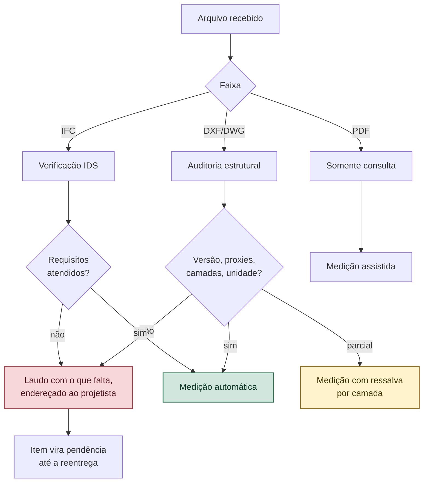

# VÉRTICE — Entrega de Projeto para Medição

**Versão:** 1.0
**Documento-pai:** `VERTICE-decisoes.md` — ADR-031
**Relacionado:** `VERTICE-modelo-universal.md`, `VERTICE-agente-antagonista.md`

---

## 1. A dor real

Orçamentista recebe o que o projetista tem em mãos, não o que ele precisa. E cada conversão degrada o arquivo em silêncio: o resultado abre, desenha bonito na tela e **está destruído para medição**.

A pesquisa da área é direta a respeito: o IFC perde informação a cada ciclo de importação e exportação, o que leva a quantidades erradas e estimativas incorretas. E a solução adotada na prática não é escolher um formato mágico — é **dar diretriz de modelagem e exportação a quem produz o arquivo**.

> **Não se pede um formato. Pede-se um formato produzido de um jeito específico, e valida-se na chegada.**

### 1.1 O caso que prova

Rebaixar um DXF para a versão R12 provoca: MTEXT explodido em primitivas, HATCH explodido, multileader explodido, LWPOLYLINE convertida em POLYLINE, spline e elipse achatadas em polilinha.

Depois disso, medir área por hachura é impossível, ler legenda é impossível, e o comprimento da polilinha carrega erro de aproximação. O arquivo abre normalmente. Ninguém percebe.

É por isso que a regra de aceitação do VÉRTICE **rejeita arquivo rebaixado**, mesmo que ele pareça íntegro.

---

## 2. O que pedir

Em ordem de preferência. O aplicativo aceita as três faixas, com aviso de qualidade em cada uma.

### Faixa A — modelo BIM (preferida)

**IFC 4, exportado nativamente pela ferramenta de autoria.**

Requisitos:

| Item | Exigência |
|------|-----------|
| Exportação | Direta da ferramenta que modelou. Nunca reexportada a partir de outro IFC |
| Quantidades base | Presentes nos conjuntos de propriedades padrão do IFC |
| Espaços | Ambientes modelados como espaço, não apenas hachura de piso |
| Classificação | Atribuída aos elementos, preferencialmente NBR 15965 |
| Aberturas | Modeladas como abertura de verdade, não apagadas da parede |
| Unidade | Declarada no arquivo |

**Por que sem reexportação:** cada passagem entre ferramentas perde dado. Um IFC gerado a partir de outro IFC já está na segunda geração de perda.

### Faixa B — desenho vetorial 2D

**DXF R2013 ou superior, em ASCII, exportado nativamente pela ferramenta de autoria.**

| Item | Exigência |
|------|-----------|
| Versão | R2013 ou superior. **R12 é recusado** |
| Origem | Exportado do aplicativo que desenhou, sem conversor de terceiros na cadeia |
| Camadas | Separadas por serviço ou por elemento, com nomenclatura consistente |
| Entidades | Sem objetos proxy de terceiros. Se houver, explodir antes de exportar |
| Referências externas | Vinculadas e inseridas, ou entregues junto |
| Cotas | Como entidade de cota, não como texto solto |
| Unidade | Declarada no cabeçalho do arquivo |
| Escala | 1:1 no espaço do modelo |

DWG é aceito, com conversão para DXF feita pelo próprio aplicativo — conversão que, segundo a documentação da biblioteca de leitura, produz resultado melhor que qualquer rebaixamento interno.

### Faixa C — documento sem geometria

**PDF vetorial ou imagem.** Aceito apenas para consulta e calibração manual. **Não gera quantitativo automático.**

O aplicativo diz isso na cara do usuário na importação. Não existe extração confiável a partir de PDF, e prometer isso seria o mesmo tipo de promessa que produz orçamento errado.

---

## 3. Carta de requisitos ao projetista

O VÉRTICE **gera o pedido**, não deixa o orçamentista improvisar por WhatsApp. Um documento de uma página, por faixa, com o que entregar e como exportar.

Para a faixa A, o pedido vai acompanhado de uma **especificação legível por máquina** — o padrão IDS, do ecossistema aberto de BIM, que declara requisitos de informação de forma auditável automaticamente.

O projetista roda a verificação **antes** de enviar. Isso desloca a correção para onde ela custa dez vezes menos: na mão de quem tem o modelo aberto.

---

## 4. Validação na chegada

Nenhum arquivo entra sem passar por triagem. O resultado é um **laudo de entrega**, não um erro genérico.

### 4.1 Verificações de triagem

| Código | Verificação | Consequência |
|--------|-------------|--------------|
| `E-CAD-01` | Versão de DXF abaixo de R2013 | **Recusa.** Arquivo rebaixado destrói a geometria de medição |
| `E-CAD-02` | Entidades proxy presentes | Aviso; entidades não medíveis listadas por camada |
| `E-CAD-03` | Unidade indefinida no cabeçalho | Exige calibração antes de qualquer extração |
| `E-CAD-04` | Todas as entidades na camada padrão | Medição automática indisponível; oferece modo assistido |
| `E-CAD-05` | Referência externa ausente | Lista o que falta, por nome |
| `E-CAD-06` | Cotas como texto solto | Validação cruzada de escala indisponível |
| `E-CAD-07` | Escala diferente de 1:1 no modelo | Fator declarado e visível em caráter permanente |
| `E-CAD-08` | IFC sem quantidades base | Cai para extração geométrica, com aviso |
| `E-CAD-09` | IFC sem espaços modelados | Ambiente por grafo planar, com aviso |
| `E-CAD-10` | IFC reexportado a partir de outro IFC | Aviso de segunda geração de perda |

A biblioteca de leitura oferece auditoria e inspeção de arquivo por linha de comando, e preserva conteúdo de terceiros na leitura — a triagem se apoia nisso, não em heurística própria.

### 4.2 O laudo é endereçado ao projetista

Diferença que importa: o laudo não diz "arquivo inválido". Ele diz o que falta, em que camada, e como exportar de novo. É documento que o orçamentista **encaminha**, e que resolve o problema na origem.

---

## 5. Sugestões vindas da prática

Levantadas de discussões entre quem faz isso diariamente, e das limitações reportadas na literatura da área.

1. **Diretriz de modelagem vale mais que ferramenta.** É a conclusão convergente: automação de medição só funciona quando quem modela sabe o que o orçamento vai extrair. O VÉRTICE entrega essa diretriz junto do pedido.

2. **Interoperabilidade plena entre ferramentas de autoria não existe.** Os algoritmos de extração precisam ser tolerantes à ferramenta de origem, e não assumir uma. Por isso a extração tem sempre um caminho geométrico de retaguarda, mesmo quando o arquivo traz quantidades declaradas.

3. **Nunca confiar cegamente na quantidade que vem no arquivo.** Ela pode ter sido calculada com critério diferente do critério de medição adotado. O VÉRTICE compara a quantidade declarada com a geométrica e **mostra a divergência** em vez de escolher sozinho.

4. **Peça o arquivo na versão em que foi criado.** "Salvar como versão antiga" é o pedido mais comum e o mais destrutivo.

5. **Conversão, quando inevitável, pelo conversor de referência.** Rebaixamento interno de biblioteca serve para exportar para máquina de corte, não para medir obra.

6. **Guardar o arquivo original junto do orçamento.** Sem isso, refazer a medição dois anos depois é impossível. O hash do arquivo entra na rastreabilidade.

---

## 6. Testes de aceite

| # | Cenário | Esperado |
|---|---------|----------|
| E01 | DXF R12 | Recusa com `E-CAD-01` e orientação de reexportação |
| E02 | DXF R2018 nativo com camadas | Medição automática |
| E03 | DXF com proxies | Aviso, lista de entidades não medíveis |
| E04 | Arquivo sem unidade | Calibração obrigatória antes da extração |
| E05 | Tudo na camada padrão | Medição assistida oferecida, automática bloqueada |
| E06 | IFC com quantidades base | Itens criados sem classificação por IA |
| E07 | IFC sem espaços | Ambiente por grafo planar, com aviso |
| E08 | Quantidade declarada divergindo da geométrica | Divergência exibida; nenhuma escolhida automaticamente |
| E09 | PDF | Somente consulta, sem quantitativo automático |
| E10 | Laudo de entrega | Legível pelo projetista, com camada e ação |
| E11 | Arquivo aceito | Hash registrado junto do orçamento |
| E12 | Reentrega corrigida | Pendências reabrem e recalculam |

---

## 7. Histórico

| Versão | Data | Alteração |
|--------|------|-----------|
| 1.0 | 13/09/2026 | Documento inicial. Três faixas de entrega, recusa de DXF rebaixado, laudo endereçado ao projetista e especificação legível por máquina para entrega BIM |
