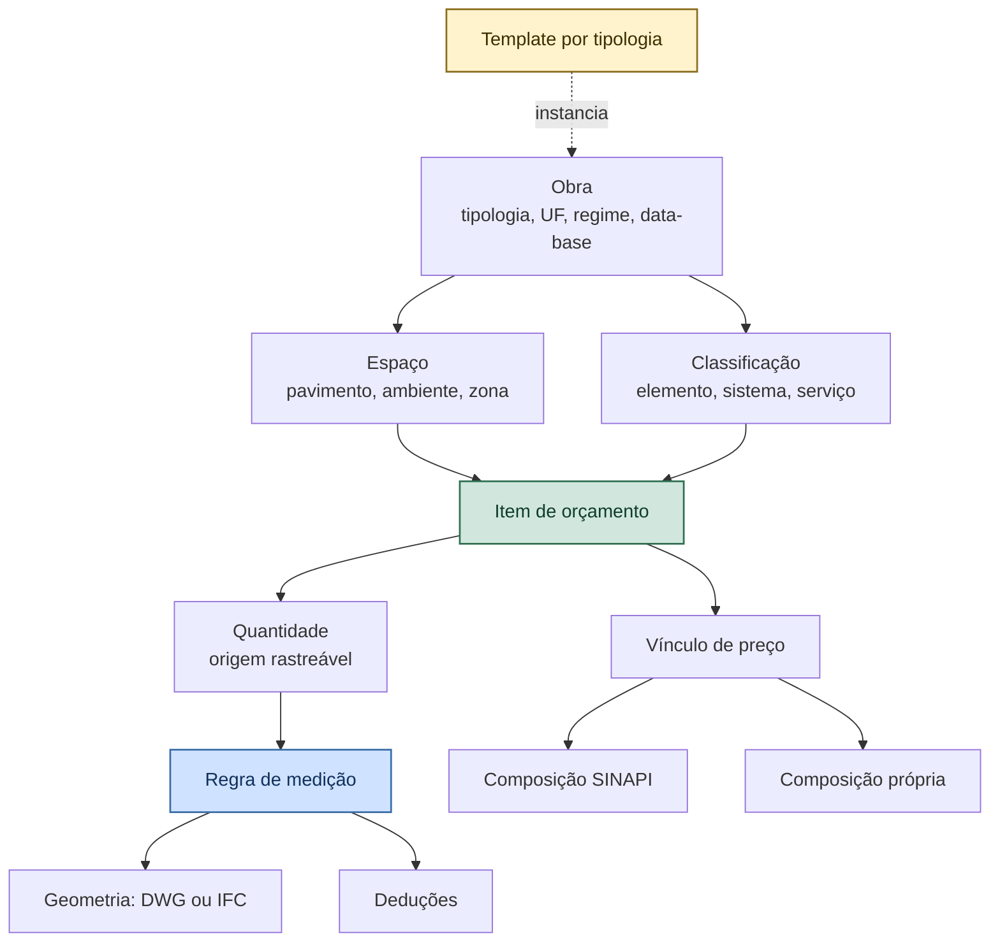

# VÉRTICE — Modelo Universal de Obra

**Versão:** 0.1
**Documento-pai:** `VERTICE-decisoes.md` — ADR-013 a ADR-017
**Relacionado:** `VERTICE-modulo-sinapi.md`, `VERTICE-modulo-precificacao.md`, `VERTICE-agente-antagonista.md`

---

## 1. O erro que este documento corrige

A planilha do CME da Santa Casa foi a melhor fonte possível para entender o domínio: é um orçamento real, auditado, com metodologia rigorosa. Mas ela é **uma instância**, não o modelo.

Se o VÉRTICE for desenhado a partir dela, nasce um aplicativo para reformar central de material esterilizado. "Nicho A2", "Pass-through" e "Rodapé sanitário" não são categorias de orçamento — são itens de uma obra específica. O mesmo vale para a estrutura em dezoito abas: aquilo é a forma que o Excel impôs a um problema, não a forma do problema.

Este documento define o modelo que serve a qualquer obra, e lista os processos daquela planilha que **não devem existir** num aplicativo.

---

## 2. Processos a eliminar

Auditando a planilha, a maior parte do trabalho humano registrado ali é redigitação de dado derivado. Um aplicativo que reproduza essas abas como trabalho manual não resolve nada — só troca o Excel de lugar.

| Processo na planilha | Trabalho humano hoje | No VÉRTICE | Por quê |
|----------------------|----------------------|------------|---------|
| Aba de memória de cálculo | Digitar expressão, entradas, origem e destino de cada conta | **Gerada** do registro declarativo de fórmulas | O app já tem essa informação. Redigitar é onde nasce a divergência |
| Aba de auditoria SINAPI | Copiar valor, colar na coluna de verificação | **Gerada** do confronto com a base importada | Conferência auto-referente foi erro real: os dois lados liam a mesma origem |
| Aba de fontes | Manter lista à mão | **Gerada** dos vínculos de fonte de cada item | Fonte é atributo do item, não documento paralelo |
| Bloco "resumo dos CPUs ativos" | Espelhar por fórmula as colunas ao lado | **Não existe** | Era duplicação com deslocamento de uma linha |
| Aba de sensibilidade | Escrever fórmula de cenário à mão | **Gerada** pelo mesmo motor do orçamento | Fórmula paralela apontou CPU errada e inflou o cenário em R$ 19,4 mil |
| Aba de matriz de aderência | Preencher manualmente a relação item × código | **Gerada** do vínculo já existente | O vínculo já está no item |
| Quantitativos de requadro, verga, chapisco | Calcular à mão a cada vão | **Regra de medição** parametrizada | Vão de porta gera sempre os mesmos serviços derivados |
| Descontar vão de esquadria da área de parede | Subtrair manualmente | **Dedução automática** | §5.3 |
| Curva ABC e cronograma financeiro | Montar à parte | **Derivados**, nunca armazenados | Dado derivado que se guarda é dado que diverge |
| Conferência entre planilha detalhada e EAP | Comparar à mão | **Regra do antagonista** | `A-EST-02` e `A-EST-03` |

**Regra geral:** se o aplicativo pode derivar, ele deriva. O que o usuário digita é apenas o que só ele sabe — decisão, premissa, justificativa e fonte.

Das dezoito abas da planilha-modelo, **onze são saída derivada**. Sete carregam entrada real: capa, premissas, quantitativos, composições próprias, BDI, taxas e divergências.

---

## 3. Estado da arte

Levantamento feito em português, inglês e chinês. O que interessa aqui não é a lista de produtos, e sim **quais decisões de arquitetura eles já resolveram**.

### 3.1 China — o mercado mais maduro em medição automatizada

A China separou o padrão de **precificação** (GB/T 50500-2024, em vigor desde setembro de 2025, substituindo a norma de 2013) dos padrões de **cálculo de quantitativos**, que são dez, particionados por disciplina: edificações e acabamentos, construção em estilo tradicional, instalações gerais, obras viárias urbanas, paisagismo, mineração, estruturas especiais, metrô, demolição por explosivos.

Isso resolve por particionamento o problema de "cobrir toda obra": ninguém escreve uma EAP universal. Escreve-se um conjunto de regras de medição por disciplina, e as regras são **dados**.

Da plataforma GTJ2026 da Glodon, quatro conceitos aproveitáveis:

| Conceito | O que é | Consequência para o VÉRTICE |
|----------|---------|-----------------------------|
| **Regras embutidas por região** | O software traz as regras de medição e de listagem de cada localidade | Regra de medição é tabela, nunca código |
| **Extração por regra** | O usuário define o critério e o sistema vincula itens da lista aos elementos em lote, por pavimento, trecho, tipo ou percentual executado | O mapeamento camada → serviço vira regra reutilizável, não trabalho manual repetido |
| **Atualização incremental** | Projeto alterado atualiza o modelo de quantitativos e o custo sem refazer nada | Reforma muda o tempo inteiro. Refazer a medição a cada revisão é o custo escondido do orçamento |
| **Modelagem única com vínculo bidirecional** | Modela-se uma vez; alteração propaga para todas as vistas | Quantidade tem uma origem só |

O ganho declarado da inversão de fluxo é o mais relevante: sai o encadeamento linear "projetar, remodelar, medir, devolver" e entra "projetar, medir em tempo real, verificar em tempo real, otimizar". A medição deixa de ser etapa e vira estado.

### 3.2 Padrão aberto — IFC

O IFC já contempla orçamento nativamente: existem entidades para cronograma de custos e itens de custo, com fórmulas, subtotais e **vínculo paramétrico à quantidade do elemento**. A biblioteca IfcOpenShell oferece isso em Python, que é exatamente a linguagem do núcleo do VÉRTICE, e o ecossistema traz ferramentas de linha de comando para conversão, comparação entre modelos e verificação de requisitos.

Duas delas mudam decisões de projeto:

- **Comparação entre modelos** — dá atualização incremental sem inventar algoritmo.
- **IDS — Information Delivery Specification** — formato legível por máquina para declarar requisitos de informação e auditar um modelo contra eles. É, literalmente, o agente antagonista em formato padronizado e aberto.

### 3.3 Brasil — a lacuna estrutural

O Brasil tem a ABNT NBR 15965, sistema multifacetado de classificação da informação da construção, com tabelas para produtos, funções, equipamentos, resultados, unidades e espaços.

E tem um problema documentado: **a NBR 15965 e o SINAPI não se falam**. Há pesquisa acadêmica propondo a correspondência entre composições SINAPI e as facetas da norma, justamente porque a incompatibilidade dificulta a interoperabilidade. A própria Caixa iniciou a classificação de insumos pela norma, mas as composições ainda não foram classificadas.

Há também trabalho brasileiro mapeando especificações IFC contra requisitos de 176 composições SINAPI de concreto armado moldado in loco, com abordagem em três vias: extração direta do esquema, representação geométrica e propriedades customizadas.

**Conclusão honesta:** o Brasil não tem o equivalente aos dez padrões chineses de cálculo. Não existe norma nacional que diga, com força normativa, como medir cada serviço. Cada órgão publica seu critério de medição em edital.

Isso é ameaça e oportunidade. Ameaça porque não há de onde copiar a tabela pronta. Oportunidade porque **o escritório que padroniza os próprios critérios de medição ganha consistência entre orçamentos**, e o VÉRTICE pode ser o lugar onde esse acervo mora.

---

## 4. Decisões derivadas

### ADR-013 — Regra de medição é dado

Como calcular a quantidade de cada serviço é **tabela versionada**, nunca código. Cada regra declara: serviço, unidade, expressão, entidades geométricas de origem, deduções aplicáveis, serviços derivados e fonte do critério.

```yaml
regra: alvenaria_vedacao
servico_padrao: SINAPI/103358
unidade: m2
origem: [POLILINHA_PAREDE]
expressao: "comprimento * pe_direito"
deducoes:
  - tipo: VAO_ESQUADRIA
    criterio: "area > 2.0"          # critério do edital, editável
servicos_derivados:
  - {regra: chapisco,  fator: 2.0}  # duas faces
  - {regra: massa_unica, fator: 2.0}
  - {regra: verga,     quando: "existe_vao", expressao: "largura_vao + 0.60"}
fonte: "Critério de medição do escritório, rev. 2026-09"
```

Trocar o critério de dedução de vãos é editar uma linha, não recompilar. E o critério fica registrado como fonte — que é o que a auditoria pergunta.

### ADR-014 — Classificação como eixo da EAP

A EAP não é lista de grupos digitados a cada obra. É árvore de classificação, com dois eixos independentes:

- **Eixo do resultado** — o que está sendo construído: elemento, sistema, serviço. Alinhado à NBR 15965.
- **Eixo do espaço** — onde: pavimento, ambiente, zona.

O item de orçamento é a interseção. "Alvenaria de vedação" × "Sala de preparo" é uma célula, não um grupo inventado. A obra do CME, nesse modelo, não tem grupo "Nicho A2": tem serviços classificados, localizados no espaço "Nicho da autoclave".

Isso é o que torna a biblioteca de composições reutilizável entre obras — e o que permite comparar duas obras.

### ADR-015 — Dedução automática

Elementos que se sobrepõem geram desconto automático, com o critério vindo da regra de medição: vão de esquadria desconta da parede acima do limiar configurado, pilar desconta da alvenaria, laje desconta da área de forro.

**Esta é uma lacuna real do que eu havia especificado.** A extração determinística que descrevi somava comprimentos e áreas por camada, sem nenhum tratamento de sobreposição. Numa parede com três portas, o erro é de dezenas de metros quadrados.

### ADR-016 — Ambiente fechado é entidade de primeira classe

Registrei na versão anterior, como utopia `U-003`, a detecção de recinto fechado — e estava errado em registrá-la assim. Utopia é ideal cujo conserto diverge; este é problema **resolvido no estado da arte**, com gestão de região fechada sendo funcionalidade corrente em plataforma comercial madura.

O ambiente passa a ser entidade: tem perímetro, área de piso, pé-direito, área de parede, área de forro e destinação. Dele derivam coerências que o antagonista verifica — perímetro de rodapé contra área de piso, área de forro contra área de piso — e que hoje seriam impossíveis.

`U-003` é reclassificada de `UTOPIA` para escopo da F2.

### ADR-017 — IFC como caminho de alta fidelidade

DWG continua sendo o caminho principal: é o que o escritório brasileiro médio entrega. Mas IFC entra como segunda entrada **desde o modelo de dados**, não como integração futura.

O motivo é econômico, não técnico: em IFC, a classificação e as quantidades já vêm no arquivo. Some a etapa de adivinhar o que a camada significa, e some a necessidade da IA para isso. O caminho DWG com classificação por IA existe porque o DWG não carrega semântica — não porque IA seja desejável.

Quando o cliente entrega IFC, o VÉRTICE deve ficar **mais simples**, não mais complexo.

---

## 5. Modelo de dados



```sql
CREATE TABLE espaco (
    id            INTEGER PRIMARY KEY,
    id_obra       INTEGER NOT NULL REFERENCES obra(id),
    id_pai        INTEGER REFERENCES espaco(id),
    tipo          TEXT NOT NULL CHECK (tipo IN ('PAVIMENTO','AMBIENTE','ZONA','EXTERNO')),
    nome          TEXT NOT NULL,
    area_piso     TEXT,              -- decimal exato; arquitetura §5.1
    perimetro     TEXT,
    pe_direito    TEXT,
    area_parede   TEXT,
    area_forro    TEXT,
    destinacao    TEXT,              -- crítico, semicrítico, não crítico, circulação
    origem        TEXT NOT NULL CHECK (origem IN ('DESENHO','IFC','MANUAL')),
    id_origem     TEXT NOT NULL      -- formato em arquitetura §4.1
);

CREATE TABLE regra_medicao (
    codigo             TEXT PRIMARY KEY,
    descricao          TEXT NOT NULL,
    unidade            TEXT NOT NULL,
    expressao          TEXT NOT NULL,
    entidades_origem   TEXT NOT NULL,     -- JSON
    deducoes           TEXT,              -- JSON
    servicos_derivados TEXT,              -- JSON
    disciplina         TEXT NOT NULL,
    id_fonte           INTEGER NOT NULL REFERENCES fonte(id),
    versao             TEXT NOT NULL
);

CREATE TABLE item_orcamento (
    id                 INTEGER PRIMARY KEY,
    id_obra            INTEGER NOT NULL REFERENCES obra(id),
    id_espaco          INTEGER REFERENCES espaco(id),
    classificacao      TEXT NOT NULL,     -- código da classificação
    codigo_regra       TEXT REFERENCES regra_medicao(codigo),
    quantidade         TEXT NOT NULL,     -- decimal exato; arquitetura §5.1
    origem_quantidade  TEXT NOT NULL CHECK (origem_quantidade IN
                          ('REGRA_DESENHO','REGRA_IFC','MEMORIA_MANUAL','TEMPLATE')),
    memoria            TEXT NOT NULL,     -- a conta, legível
    tipo_vinculo       TEXT NOT NULL CHECK (tipo_vinculo IN ('SINAPI','CPU','PENDENTE')),
    codigo_vinculo     TEXT,
    id_origem          TEXT NOT NULL      -- formato em arquitetura §4.1
);
```

`origem_quantidade` e `memoria` são `NOT NULL` por decisão: quantidade sem origem rastreável é a regra `A-QNT-01` do antagonista disparando na hora do cadastro. `origem_quantidade` classifica, `memoria` explica ao humano e `id_origem` resolve por máquina — as três respondem perguntas diferentes, conforme `VERTICE-arquitetura.md` §4.1.

---

## 6. Cobertura: o que toda obra tem

A cobertura não vem de uma EAP gigante. Vem de **templates por tipologia**, que instanciam uma árvore de classificação com as regras de medição já vinculadas.

| Grupo | Presente em | Observação |
|-------|-------------|------------|
| Serviços preliminares e canteiro | Toda obra | Mobilização, tapume, ligações provisórias |
| Administração local | Toda obra | Item mensurável, vindo do cronograma |
| Demolições e remoções | Reforma e retrofit | Interligada com reforço estrutural |
| Movimento de terra | Obra nova, infraestrutura | — |
| Fundações | Obra nova | — |
| Estrutura | Obra nova, ampliação | Concreto, metálica, madeira, pré-moldada |
| Alvenaria e vedações | Quase toda obra | — |
| Cobertura e impermeabilização | Edificação | — |
| Esquadrias | Edificação | — |
| Instalações hidrossanitárias | Edificação | — |
| Instalações elétricas e SPDA | Edificação | — |
| Climatização e exaustão | Conforme uso | — |
| Prevenção e combate a incêndio | Conforme enquadramento | — |
| Gases medicinais | Hospitalar | Especialidade |
| Revestimentos e acabamentos | Toda obra | — |
| Louças, metais e acessórios | Edificação | — |
| Equipamentos e mobiliário fixo | Conforme uso | — |
| Urbanização e paisagismo | Conforme escopo | — |
| Resíduos e destinação | Toda obra | Frequentemente esquecido |
| Limpeza, testes e comissionamento | Toda obra | — |
| Taxas, licenças e responsabilidade técnica | Toda obra | Fora do BDI |

Tipologias iniciais: **reforma hospitalar** (validada pelo CME), **edificação residencial**, **edificação comercial**, **retrofit corporativo**, **obra pública padrão**.

Cada template é um arquivo versionado. Criar tipologia nova é escrever dados, não código — e é o que permite o escritório especializar o produto sem depender do desenvolvedor.

---

## 7. Impacto no roadmap

| Fase | Muda para |
|------|-----------|
| **F0** | Acrescenta a tabela de regras de medição e a árvore de classificação. Sem elas, a F1 nasce com EAP digitada à mão |
| **F1** | Templates por tipologia entram como entrega. O aceite continua sendo reconstruir o CME — agora **instanciando a tipologia hospitalar**, não digitando grupos |
| **F2** | Ambiente fechado e dedução automática entram no escopo. `U-003` sai do registro de utopias |
| **F2b** | **Nova.** Entrada IFC com IfcOpenShell. Menor esforço que a F3 e resultado melhor quando o cliente entrega IFC |
| **F3** | Escopo reduzido: a IA classifica camada de DWG. Em IFC ela não é necessária |
| **F4** | Atualização incremental: comparar duas versões do projeto e atualizar só o que mudou |

A F2b é a recomendação mais forte deste documento. **Investir em IFC dá mais retorno que investir em IA**, porque ataca a causa — falta de semântica no DWG — em vez do sintoma.

---

## 8. Testes de aceite

| # | Cenário | Esperado |
|---|---------|----------|
| U01 | Instanciar tipologia hospitalar e reconstruir o CME | R$ 141.194,42, sem digitar grupo |
| U02 | Instanciar tipologia residencial | Nenhum resquício de vocabulário hospitalar |
| U03 | Parede de 30 m² com duas portas de 1,68 m² | Área líquida com dedução aplicada conforme a regra |
| U04 | Alterar o critério de dedução | Recálculo sem tocar em código; fonte do critério registrada |
| U05 | Vão de porta lançado | Verga, chapisco e massa derivados automaticamente |
| U06 | Ambiente com perímetro incompatível com a área | `A-QNT-04` dispara |
| U07 | Importar IFC com quantidades | Itens criados sem etapa de classificação por IA |
| U08 | Mesma obra em DWG e em IFC | Quantidades convergem dentro da tolerância |
| U09 | Segunda versão do projeto | Só os itens afetados são recalculados |
| U10 | Regra de medição sem fonte | Cadastro rejeitado |
| U11 | Template de tipologia versionado | Obra registra qual versão instanciou |
| U12 | Item sem origem de quantidade | `A-QNT-01` dispara no cadastro |

---

## 9. Histórico

| Versão | Data | Alteração |
|--------|------|-----------|
| 0.1 | 13/09/2026 | Documento inicial. Levantamento do estado da arte em três idiomas. ADR-013 a ADR-017. Onze das dezoito abas da planilha-modelo reclassificadas como saída derivada. `U-003` reclassificada de utopia para escopo da F2. Fase F2b criada |
