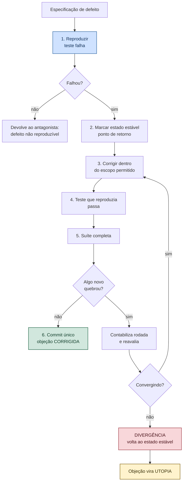

# VÉRTICE — Módulo Correct

**Versão:** 0.2
**Documento-pai:** `VERTICE-decisoes.md` — ADR-012
**Relacionado:** `VERTICE-agente-antagonista.md`, `VERTICE-LINT-SUITE.md`, `VERTICE-REGRAS.md`

---

## 1. Papel

O Correct consome **especificações de defeito** produzidas pelo antagonista e as transforma em correção verificada. Não investiga, não decide prioridade, não julga se a objeção procede — isso já foi feito por quem veio antes.

```text
LINT mede  →  ANTAGONISTA especifica  →  DEV decide  →  CORRECT conserta  →  LINT confirma
```

A separação existe porque misturar diagnóstico com conserto produz o pior padrão que existe em correção de software: consertar o sintoma que se enxerga primeiro, antes de mapear o conjunto. É a mesma razão da §2.2 do `VERTICE-REGRAS.md`.

### 1.1 O que ele nunca faz

- Não escolhe qual defeito atacar. O desenvolvedor autoriza, um por vez ou em lote explícito.
- Não sai do `escopo_permitido` da especificação.
- Não introduz abstração nova. Correção que precisa de camada nova não é correção: é redesenho, e volta como proposta.
- Não altera teste-âncora. Se a correção exige mudar R$ 141.194,42, a correção está errada ou a decisão precisa ser tomada por quem tem autoridade.
- Não corrige dois defeitos no mesmo commit.

---

## 2. Protocolo de correção

Sequência obrigatória. Pular etapa invalida a correção.



### 2.1 Etapa 1 é inegociável

Sem teste que falha antes, não existe prova de que a correção funcionou. Defeito não reproduzível volta ao antagonista com essa marca — pode ser regra mal escrita, ambiente diferente ou objeção improcedente.

### 2.2 Etapa 2 é o que torna a divergência reversível

Antes de tocar em qualquer linha, o Correct registra o commit atual como **ponto de retorno**. Se o laço divergir, o retorno é mecânico e completo. Sem esse marco, "infinity code" deixa rastro: meia dúzia de correções parciais espalhadas pelo repositório, cada uma quebrando algo diferente.

---

## 3. Divergência do laço — o problema do *infinity code*

O cenário: corrigir A quebra B. Corrigir B quebra A. Ou pior — cada rodada de correção precisa tocar mais arquivos que a anterior, e o conserto cresce sem nunca fechar.

Isso não é bug difícil. É **sinal de que o defeito não está onde a objeção aponta**, e que o sistema atual não comporta a correção pedida sem redesenho.

### 3.1 Detectores

Cinco, executados a cada rodada. Um disparo basta.

| Código | Detector | Critério |
|--------|----------|----------|
| `D-01` | Ping-pong | Corrigir X reabre Y; corrigir Y reabre X. Ciclo no grafo de objeções |
| `D-02` | Reincidência | A mesma dupla regra + alvo reaparece pela terceira vez |
| `D-03` | Expansão de escopo | Arquivos tocados crescem duas rodadas seguidas |
| `D-04` | Cascata | Uma correção gera mais de três objeções novas |
| `D-05` | Desproporção | Severidade média ou baixa exigindo mudança estrutural |

### 3.2 Métrica de convergência

O laço converge quando o número de objeções abertas **e** o número de arquivos tocados decrescem. Duas rodadas sem decréscimo em nenhum dos dois é divergência declarada.

```text
rodada 1:  12 objeções,  4 arquivos
rodada 2:   8 objeções,  3 arquivos   → convergindo
rodada 3:   9 objeções,  7 arquivos   → alerta
rodada 4:  11 objeções, 12 arquivos   → DIVERGÊNCIA
```

### 3.3 Limite absoluto

Independentemente dos detectores, **nenhuma objeção passa de cinco rodadas de correção**. O limite é arbitrário de propósito: existe para garantir que o laço termina mesmo quando nenhum detector pega o padrão. Sistema sem limite superior é sistema que pode rodar para sempre.

### 3.4 Ação na divergência

1. Retorno ao ponto de retorno da etapa 2. O repositório volta ao estado estável, íntegro.
2. A objeção e as que participaram do ciclo passam a `UTOPIA`.
3. Registro no `registros/utopias.md`, na forma da §4.
4. A objeção **para de ser emitida** enquanto a condição de reabertura não ocorrer. Sem isso, o antagonista repete a mesma acusação para sempre e vira ruído.
5. O relatório de sessão registra a divergência, com as rodadas e as métricas.

---

## 4. Utopia

> **Utopia é um ideal correto que o sistema atual não alcança a custo aceitável.**

A escolha do termo importa. Não é "não vai ser corrigido", não é "wontfix", não é bug rejeitado. A objeção **continua procedente** — o que se reconhece é que persegui-la, agora, destrói mais do que conserta.

### 4.1 O que utopia não é

| Não confundir com | Diferença |
|-------------------|-----------|
| `REFUTADA` | Ali a objeção era improcedente. Aqui ela procede |
| `ACEITA_COM_RISCO` | Ali houve decisão de prioridade. Aqui houve tentativa que divergiu, com evidência |
| Dívida técnica genérica | Utopia tem causa medida, tentativa registrada e condição de reabertura |
| Limitação permanente | Utopia tem gatilho. Ela volta quando a premissa mudar |

### 4.2 Registro

```yaml
id: U-003
objecao_origem: A-QNT-03
titulo: "Coerência geométrica entre piso e teto por ambiente"
ideal: >
  O antagonista deveria detectar divergência entre área de piso e
  área de teto do mesmo ambiente e apontar erro de quantificação.
por_que_diverge: >
  Exige que o app tenha o conceito de ambiente fechado, que hoje não
  existe: a extração trabalha por camada, não por recinto. Toda
  tentativa de inferir ambiente a partir de polilinhas soltas gerou
  falso positivo em planta com paredes interrompidas por vãos.
rodadas_tentadas: 4
metrica_divergencia: "D-03 e D-04: 3 -> 7 -> 14 arquivos; 9 objeções novas"
custo_estimado: "Detecção de recinto fechado: reescrita do extrator"
condicao_de_reabertura: >
  Quando existir detecção de ambiente fechado no extrator — previsto
  para a F4 — ou quando o desenho trouxer polilinhas de ambiente
  em camada própria.
data: 2026-09-13
decidido_por: RT
situacao: ABERTA
```

### 4.3 Caso real de reclassificação

A utopia `U-003` — coerência geométrica entre piso e teto por ambiente — foi criada e **desfeita no mesmo dia**, ao levantar o estado da arte: gestão de região fechada é funcionalidade corrente em plataforma comercial madura de medição. O conserto não divergia por ser impossível; divergia porque a arquitetura não tinha o conceito de ambiente.

Lição incorporada ao procedimento: **antes de registrar utopia, verificar se o estado da arte resolveu**. Divergência costuma indicar abstração faltando, não limite real. A etapa virou obrigatória na §4.4.

- No `registros/utopias.md`, versionado no repositório.
- No relatório de sessão do estágio em que surgiu.
- Na lista de limitações conhecidas do produto, quando afeta o usuário final.
- **Nunca no orçamento exportado.** Utopia é assunto de desenvolvimento, não do cliente.

### 4.4 Revisão

Antes de registrar qualquer utopia, uma verificação obrigatória: **o estado da arte já resolveu isso?** Se resolveu, não é utopia — é abstração faltando, e o caminho é redesenho, não registro.

Toda utopia é relida no encerramento de cada estágio. A pergunta é uma só: *a condição de reabertura ocorreu?* Se sim, a objeção volta a `ABERTA` com contador de rodadas zerado.

Utopia que passa três estágios sem revisão vira objeção `A-DEV-12` — divergência entre o que o sistema promete e o que entrega, sem registro atualizado.

---

## 5. Modelo de dados

```sql
CREATE TABLE utopia (
    id                      INTEGER PRIMARY KEY,
    codigo                  TEXT NOT NULL UNIQUE,     -- 'U-003'
    objecao_origem          TEXT NOT NULL,
    titulo                  TEXT NOT NULL,
    ideal                   TEXT NOT NULL,
    por_que_diverge         TEXT NOT NULL,
    rodadas_tentadas        INTEGER NOT NULL,
    metrica_divergencia     TEXT NOT NULL,
    custo_estimado          TEXT,
    condicao_de_reabertura  TEXT NOT NULL,
    estagio_origem          TEXT NOT NULL,
    decidido_por            TEXT NOT NULL,
    data                    TEXT NOT NULL,
    situacao                TEXT NOT NULL CHECK (situacao IN ('ABERTA','REABERTA','RESOLVIDA'))
);

CREATE TABLE rodada_correcao (
    id                 INTEGER PRIMARY KEY,
    id_objecao         INTEGER NOT NULL REFERENCES objecao(id),
    numero             INTEGER NOT NULL,
    commit_retorno     TEXT NOT NULL,
    arquivos_tocados   INTEGER NOT NULL,
    objecoes_abertas   INTEGER NOT NULL,
    objecoes_novas     INTEGER NOT NULL,
    detector_disparado TEXT,
    resultado          TEXT NOT NULL CHECK (resultado IN ('CORRIGIDA','NOVA_RODADA','DIVERGENCIA')),
    executada_em       TEXT NOT NULL
);
```

`condicao_de_reabertura` é `NOT NULL` de propósito. Utopia sem gatilho de retorno é desistência disfarçada, e desistência disfarçada é como dívida técnica some do radar.

---

## 6. Correção assistida por IA

O Correct pode usar IA para propor o conserto, dentro de limites estreitos:

| Pode | Não pode |
|------|----------|
| Propor a alteração dentro do escopo permitido | Escrever direto no repositório sem revisão |
| Explicar a causa raiz | Alterar teste para fazê-lo passar |
| Sugerir teste adicional de regressão | Tocar em teste-âncora |
| Apontar que o defeito está fora do escopo apontado | Ampliar o escopo por conta própria |

**A proibição mais importante é a segunda linha.** Modelo de linguagem, pressionado a fazer um teste passar, altera o teste. É o caminho de menor resistência e destrói a única evidência de que algo funciona. O Correct trata alteração de arquivo de teste dentro de uma rodada como divergência imediata.

---

## 7. Testes de aceite

| # | Cenário | Esperado |
|---|---------|----------|
| C01 | Especificação com teste que reproduz | Correct executa e o teste falha antes da correção |
| C02 | Defeito não reproduzível | Devolvido ao antagonista, sem alteração no código |
| C03 | Correção fora do escopo permitido | Rejeitada antes de aplicar |
| C04 | Correção quebra teste-âncora | Rejeitada e devolvida ao desenvolvedor |
| C05 | Ping-pong entre duas objeções | `D-01` dispara, retorno ao estado estável |
| C06 | Escopo crescendo duas rodadas seguidas | `D-03` dispara |
| C07 | Sexta rodada na mesma objeção | Limite absoluto, divergência declarada |
| C08 | Divergência declarada | Repositório idêntico ao ponto de retorno |
| C09 | Objeção em utopia | Não reemitida até a condição de reabertura |
| C10 | Condição de reabertura satisfeita | Objeção volta a `ABERTA`, contador zerado |
| C11 | Utopia sem condição de reabertura | Registro rejeitado |
| C12 | IA tenta alterar arquivo de teste | Divergência imediata, rodada abortada |
| C13 | Duas correções no mesmo commit | Rejeitado |
| C14 | Três estágios sem revisar utopia | `A-DEV-12` emitida |

---

## 8. Histórico

| Versão | Data | Alteração |
|--------|------|-----------|
| 0.2 | 13/09/2026 | Verificação do estado da arte torna-se obrigatória antes de registrar utopia, após `U-003` ser criada e desfeita no mesmo dia |
| 0.1 | 13/09/2026 | Documento inicial. Protocolo de seis etapas, cinco detectores de divergência, limite absoluto de cinco rodadas e formalização de utopia como quarta saída de objeção |
