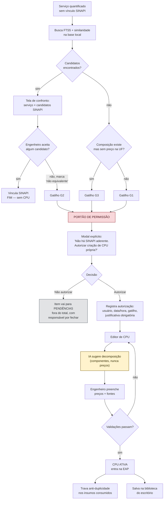
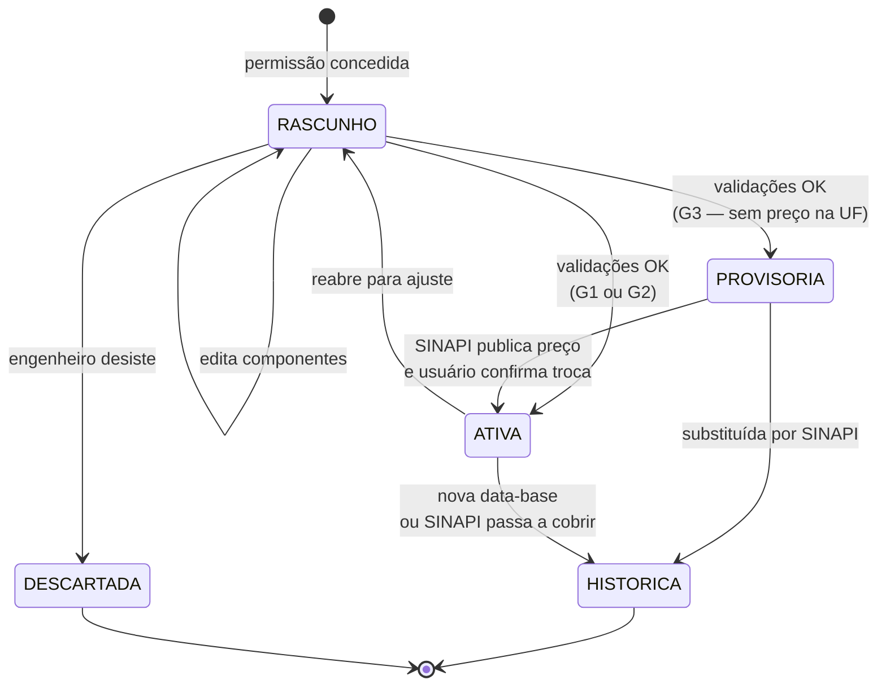

# VÉRTICE — Módulo de CPU Próprio

**Versão:** 0.4
**Documento-pai:** `VERTICE-decisoes.md` — ADR-007
**Relacionado:** `VERTICE-modulo-sinapi.md` (detecção do gatilho G3), `VERTICE-modulo-precificacao.md` (quadro de pendências), `VERTICE-agente-antagonista.md` (regras `A-CPU-01` a `A-CPU-07`)
**Modelo de referência:** `ENGEViTH_CME_SANTACASA_ABNT_SINAPI.xlsx` — orçamento auditado da reforma do CME da Santa Casa de Cerqueira César

---

## 1. Princípio

> **CPU é exceção justificada, nunca atalho.**

Quando o VÉRTICE não encontra composição SINAPI para um serviço, o comportamento padrão é **parar e perguntar**. Nunca criar preço sozinho. A planilha-modelo estabelece isso na própria abertura da aba CPUs: só entram ali sistemas sem composição SINAPI integralmente aderente; serviço que é SINAPI permanece SINAPI.

Um orçamento que inventa CPU para fechar linha não sobrevive a auditoria de tribunal de contas. Um orçamento que deixa o item explicitamente pendente, sim.

---

## 2. Os três gatilhos

A planilha-modelo contém os três casos, e eles exigem tratamentos diferentes. Confundi-los é erro de domínio, não de software.

**G3 é detectado automaticamente**, não declarado à mão: o importador da base (`VERTICE-modulo-sinapi.md`) registra a situação de cada código, e uma composição ativa sem custo divulgado na UF dispara o gatilho sozinha.

| Gatilho | Situação | Exemplo no modelo | Tratamento |
|---------|----------|-------------------|------------|
| **G1 — SEM_SINAPI** | Não existe composição para o serviço | `CPU-PT-01` — pass-through inox 600×600×600; referência auxiliar "—" | CPU própria completa, decomposta |
| **G2 — NAO_EQUIVALENTE** | A composição existe, mas não executa o mesmo serviço | `CPU-ROD-01` — a 102496 é apenas pintura de rodapé e não conforma meia-cana sanitária | CPU própria **com o código SINAPI registrado como referência comparativa**, e justificativa técnica da não equivalência |
| **G3 — SEM_PRECO_UF** | A composição existe e é equivalente, mas não tem preço publicado na UF | `CPU-PORTA-P5` — 106148 sem preço em SP 07/2026, confirmado na base oficial como composição ativa criada sem custo | CPU **provisória**, marcada para revisão na próxima data-base |

A distinção importa porque a defesa técnica de cada uma é diferente. Em G2, o auditor vai perguntar "por que não usou a 102496?" — e a resposta precisa estar gravada no item, não na cabeça do engenheiro.

---

## 3. Esgotamento da base — antes de qualquer portão

> **Ninguém cogita CPU sem antes provar que a base foi esgotada.**

O erro mais comum não é criar CPU sem justificativa. É criar CPU porque a primeira busca não achou — quando o código existia com outro nome. Por isso o portão de permissão fica **atrás** de um protocolo de esgotamento, que é obrigatório e registrado.

### 3.1 As sete passadas

Executadas em sequência, todas, sem pular. Cada uma produz registro do que foi tentado e do que retornou.

| # | Passada | O que faz | Exemplo |
|---|---------|-----------|---------|
| 1 | **Textual exata** | Termo como digitado, na descrição oficial | "rodapé sanitário" |
| 2 | **Semântica** | Similaridade por vetor local, sinônimos e variações técnicas | "meia-cana", "cantoneira sanitária", "rodapé abaulado" |
| 3 | **Por família** | Sobe ao grupo da classificação e lista todos os irmãos | Grupo "revestimentos", subgrupo "rodapés" |
| 4 | **Por decomposição** | Procura os componentes do serviço como insumos ou composições | Argamassa + mão de obra + acabamento epóxi |
| 5 | **Por composição auxiliar** | Composições internas da base que não aparecem na busca comum | Composições auxiliares de argamassa |
| 6 | **Entre datas-base** | O código existiu em referência anterior ou foi criado sem custo | Manutenções: criação sem custo, desativação recente |
| 7 | **Entre bases** | Outras bases do pacote de domínio, quando instaladas | SICRO, tabela do escritório |

Nenhuma passada é opcional. O aplicativo executa as sete automaticamente e apresenta o resultado consolidado: **o que foi encontrado e por que não serve**, ou **nada encontrado, com o registro das sete tentativas**.

### 3.2 Pesquisa por pares

Além das passadas na base, a pesquisa profunda roda uma frente específica: **como outros orçamentos e composições públicas resolveram este mesmo serviço**. Se a maioria usa determinado código SINAPI, isso é evidência forte de que ele é aderente — e a CPU provavelmente não se justifica.

O resultado entra no registro de esgotamento com as citações.

### 3.3 Confirmação por par

O esgotamento é validado por **um segundo avaliador independente** antes de o portão abrir. Duas formas admitidas, e o registro diz qual foi:

- **Par humano** — outro profissional do escritório confirma que as sete passadas foram feitas e que os candidatos apresentados não servem.
- **Antagonista** — a Camada 2 lê os candidatos rejeitados e a justificativa de rejeição, e emite objeção se a justificativa não sustentar a rejeição.

O antagonista não substitui o par humano em orçamento assinado. Ele existe para quando o escritório tem um orçamentista só — situação real, e melhor cobrir com verificação independente automatizada do que com nada.

### 3.4 Registro

```sql
CREATE TABLE esgotamento_base (
    id                  INTEGER PRIMARY KEY,
    id_item             INTEGER NOT NULL REFERENCES item_orcamento(id),
    passadas            TEXT NOT NULL,      -- JSON: as sete, com termo, resultado e contagem
    candidatos          TEXT NOT NULL,      -- JSON: código, descrição, motivo da rejeição
    pesquisa_por_pares  TEXT,               -- JSON: achados citados
    confirmado_por      TEXT NOT NULL CHECK (confirmado_por IN ('PAR_HUMANO','ANTAGONISTA')),
    confirmador         TEXT NOT NULL,
    confirmado_em       TEXT NOT NULL,
    resultado           TEXT NOT NULL CHECK (resultado IN ('BASE_ADERENTE','BASE_ESGOTADA'))
);
```

`BASE_ADERENTE` encerra o caso: vincula o código, e nenhuma CPU é criada. Só `BASE_ESGOTADA`, com confirmação registrada, libera o portão da §4.

O esgotamento é exportado junto do orçamento. Em auditoria, a pergunta "por que não usou o código X?" recebe a resposta já pronta: ele foi encontrado na passada 3, e foi rejeitado por este motivo, confirmado por este par nesta data.

---

## 4. Portão de permissão



### 3.1 O que o portão exige

A autorização **não é um clique em "OK"**. O modal exige, em campo obrigatório:

- **Justificativa técnica** — por que a composição SINAPI não serve. Texto livre, mínimo verificável, gravado no item.
- **Confirmação do gatilho** — G1, G2 ou G3, selecionado pelo usuário, não inferido pelo app.
- **Código SINAPI de referência** quando G2 ou G3.

Essa justificativa é exportada na aba de critérios técnicos. No modelo, é exatamente a coluna *"Por que permanece CPU"*.

### 3.2 Recusa é um caminho de primeira classe

Se o usuário não autoriza, o item **não some e não é precificado**. Vai para o módulo de Pendências, com prioridade, decisão adotada, impacto no total e responsável por fechar — reproduzindo a aba de divergências do modelo, onde instalações elétricas, hidráulica e gases medicinais ficaram explicitamente fora do total por falta de projeto.

Essa é uma das partes mais valiosas da metodologia: **o que não tem base técnica não entra no preço artificialmente**.

---

## 5. Anatomia da CPU — três níveis

A planilha-modelo organiza cada CPU em três camadas de informação. O app reproduz as três, porque cada uma responde a uma pergunta diferente.

### Nível 1 — Síntese (o que entra na EAP)
`CPU · Serviço/sistema · Un. · Qtd. base · Preço unit. · Total base · Referência principal · Observação`

### Nível 2 — Critério técnico (a defesa em auditoria)
`CPU · Por que permanece CPU · Componentes principais · Referência SINAPI auxiliar · Un. · Critério de preço · Controle · Observação`

### Nível 3 — Memória analítica (a conta)
`CPU · Decomposição · Critério · Qtd. · Un. · Preço/Ref. · Fonte · Status`

Exemplo do modelo, nível 3: *22,5 h de servente + consumíveis*, critério *0,5 h/dia × 45 dias*, referência SINAPI 88316. Rastreável até o insumo.

### 5.1 CPU decomposta vs. CPU de benchmark

Dois modos legítimos, e o app precisa suportar ambos:

| Modo | Como o preço nasce | Quando usar | Exemplo no modelo |
|------|-------------------|-------------|-------------------|
| **Decomposta** (preferida) | Σ (coeficiente × preço do componente) | Sempre que os componentes forem identificáveis | `CPU-PRELIM`: 22,5 h × SINAPI 88316 + R$ 500,00 de consumíveis |
| **Benchmark** | Preço único de referência pública ou cotação | Sistema proprietário fechado ou contratação comparável | `CPU-PORTA-P4`: R$ 6.940,66 de contratação pública hospitalar 2026 |

Na decomposta, o campo de preço unitário é **somente leitura** — resultado da soma. Digitar por cima seria quebrar a rastreabilidade que justifica a CPU existir.

### 5.2 CPU híbrida é o alvo

O modelo chama as composições de *"próprias ou híbridas"*, e a preferência fica clara: sempre que possível, a mão de obra sai do SINAPI (88316 servente, 88309 pedreiro, 88278 montador) e só o material específico vem de mercado. O app deve **sugerir ativamente** essa montagem — uma CPU 70% SINAPI é muito mais defensável que uma CPU 100% de cotação.

---

## 6. Modelo de dados

```sql
CREATE TABLE cpu (
    codigo                  TEXT PRIMARY KEY,      -- 'CPU-ROD-01'
    id_obra                 INTEGER NOT NULL REFERENCES obra(id),
    descricao               TEXT NOT NULL,
    unidade                 TEXT NOT NULL,
    modo                    TEXT NOT NULL CHECK (modo IN ('DECOMPOSTA','BENCHMARK')),
    gatilho                 TEXT NOT NULL CHECK (gatilho IN ('SEM_SINAPI','NAO_EQUIVALENTE','SEM_PRECO_UF')),
    justificativa_tecnica   TEXT NOT NULL,
    codigo_sinapi_referencia TEXT,                 -- obrigatório em G2 e G3
    criterio_preco          TEXT NOT NULL,
    status                  TEXT NOT NULL CHECK (status IN ('RASCUNHO','ATIVA','PROVISORIA','HISTORICA','DESCARTADA')),
    data_base               TEXT NOT NULL,         -- 'AAAA-MM' da precificação
    autorizado_por          TEXT NOT NULL,
    autorizado_em           TEXT NOT NULL,
    observacao              TEXT
);

CREATE TABLE cpu_componente (
    id              INTEGER PRIMARY KEY,
    codigo_cpu      TEXT NOT NULL REFERENCES cpu(codigo) ON DELETE CASCADE,
    tipo_origem     TEXT NOT NULL CHECK (tipo_origem IN
                        ('SINAPI_INSUMO','SINAPI_COMPOSICAO','MERCADO','REFERENCIA_PUBLICA')),
    codigo_item     TEXT,                          -- código SINAPI quando aplicável
    descricao       TEXT NOT NULL,
    unidade         TEXT NOT NULL,
    coeficiente     TEXT NOT NULL
                    CHECK (CAST(coeficiente AS NUMERIC) > 0),
    preco_unitario_centavos
                    INTEGER NOT NULL CHECK (preco_unitario_centavos >= 0),
    criterio        TEXT,                          -- '0,5 h/dia × 45 dias'
    id_fonte        INTEGER NOT NULL REFERENCES fonte(id),
    id_origem       TEXT NOT NULL                  -- formato em arquitetura §4.1
);

CREATE TABLE fonte (
    id              INTEGER PRIMARY KEY,
    tipo            TEXT NOT NULL,                 -- PROJETO, MEMORIAL, SINAPI, FABRICANTE, MERCADO, PÚBLICA, TCU
    nome            TEXT NOT NULL,
    item            TEXT NOT NULL,
    data_base       TEXT NOT NULL,
    url             TEXT,
    uso             TEXT,
    confiabilidade  TEXT NOT NULL CHECK (confiabilidade IN
                        ('PRIMARIA','PUBLICA','PUBLICA_REGIONAL','COMERCIAL','FABRICANTE')),
    observacao      TEXT
);

-- Trava anti-duplicidade: item SINAPI consumido dentro de CPU ativa
CREATE TABLE item_consumido_em_cpu (
    id_obra         INTEGER NOT NULL,
    codigo_item     TEXT NOT NULL,
    codigo_cpu      TEXT NOT NULL REFERENCES cpu(codigo) ON DELETE CASCADE,
    PRIMARY KEY (id_obra, codigo_item, codigo_cpu)
);
```

---

## 7. Regra anti-duplicidade

A planilha-modelo encerra a aba CPUs com uma nota que vale por um requisito inteiro: lista dez códigos SINAPI que **não** são CPU naquela versão, "evitando duplicidade". E a aba de memória marca componentes como *HISTÓRICO / NÃO ATIVO* com a observação *"já contido no kit"*.

Traduzido para regra de software:

> **RN-CPU-01** — Um código SINAPI registrado em `item_consumido_em_cpu` para uma obra **não pode** aparecer como linha independente na EAP dessa mesma obra.

Comportamento: ao tentar inserir o item na EAP, o app bloqueia e exibe *"A 88316 já está consumida dentro da CPU-PRELIM (22,5 h). Incluir como linha separada duplicaria o custo."* — com atalho para abrir a CPU.

Inverso também vale: ao ativar uma CPU cujos componentes já estão na EAP, o app aponta o conflito antes de salvar.

**Por que isso é crítico num app automatizado:** a IA classifica camadas e sugere códigos. Nada impede que ela sugira a 88316 como serviço autônomo enquanto a CPU-PRELIM já a consome. Sem a trava, o orçamento infla silenciosamente — e é exatamente o tipo de erro que só aparece na auditoria.

---

## 8. Rastreabilidade obrigatória

**RN-CPU-02** — Nenhum componente é salvo sem fonte vinculada. Nenhuma CPU passa a ATIVA com componente órfão.

A aba FONTES do modelo registra tipo, fonte, item, data-base, URL, uso e confiabilidade — de PDF de projeto a catálogo de fabricante, licitação municipal e acórdão do TCU. O app reproduz essa estrutura como tabela de primeira classe, não como campo de texto.

Hierarquia de confiabilidade, para ordenar candidatos e sinalizar fragilidade:

`PRIMARIA` (projeto, memorial, SINAPI, fabricante) → `PUBLICA` (licitação, acórdão) → `PUBLICA_REGIONAL` → `COMERCIAL` (cotação de loja)

CPU sustentada só por fonte `COMERCIAL` recebe selo visual de atenção. Não é proibida — é frágil, e o engenheiro precisa saber disso antes de assinar.

---

## 9. Papel da IA — e o limite duro

Extensão da regra §4.1 do documento de arquitetura:

> **A IA nunca produz número mágico.** Todo valor que ela lança cita a origem que o sustenta.

| A IA PODE | A IA NÃO PODE |
|-----------|---------------|
| Propor quais componentes entram na CPU | Atribuir coeficiente que ela mesma estimou |
| Redigir rascunho da justificativa técnica | Definir qualquer preço |
| Apontar o código SINAPI auxiliar mais próximo | Declarar equivalência ou não equivalência |
| Sugerir CPU similar já na biblioteca | Ativar uma CPU |
| Explicar por que dois códigos diferem | Preencher a fonte |

Um caso concreto do porquê: na verificação do orçamento do CME contra a base oficial, um agregador público divulgava a composição 87622 a R$ 37,91 enquanto o valor oficial em SP era R$ 40,63 no onerado e R$ 39,37 no desonerado. Nenhum dos dois. Preço sem fonte rastreável e sem regime declarado não entra — nem vindo de IA, nem de site, nem de memória.

Preço alucinado em orçamento de obra pública não é bug de usabilidade. É documento técnico falso, assinado por um profissional com ART. O validador rejeita qualquer resposta do modelo que contenha campo numérico de preço ou coeficiente — sem exceção, sem configuração que desligue.

O coeficiente é onde a tentação é maior. "0,5 h/dia parece razoável" é número mágico e não entra. **"0,5 h/dia conforme tabela técnica X, edição Y, item Z" é achado com proveniência** e entra como proposta, sujeito à confirmação do RT.

A diferença não é o valor — é a existência de documento que o sustente. Plausibilidade não qualifica número; origem qualifica.

---

## 10. Ciclo de vida



`PROVISORIA` entra no total, mas aparece destacada no relatório e no alerta de atualização mensal: *"3 CPUs provisórias — verificar se o SINAPI desta data-base já publica preço"*. No modelo, é o caso da P5, com a observação de confirmar a dimensão antes da compra.

`HISTORICA` nunca é apagada. Orçamento é documento datado; saber o que foi usado em julho importa em dezembro.

---

## 11. Biblioteca do escritório

Toda CPU ativada vira ativo reutilizável, com escopo por escritório e não por obra.

- Busca por serviço, gatilho ou código SINAPI de referência.
- Ao reutilizar, o app **força revisão da data-base**: CPU precificada em 07/2026 aplicada em 2027 abre com aviso e componentes SINAPI reprecificados automaticamente pela base local; componentes de mercado ficam marcados como "requer nova cotação".
- Contador de uso: CPU aplicada em cinco obras é candidata natural a virar padrão do escritório.

Em orçamento hospitalar isso é quase todo o valor do produto — a CPU de porta hospitalar dupla criada uma vez serve para a próxima CME.

---

## 12. Espelho de exportação

O xlsx gerado reproduz a estrutura do modelo, aba por aba:

`CAPA` · `ORÇAMENTO FINAL` · `PREMISSAS` · `QUANTITATIVOS` · `CPUs` · `ORCAMENTO_EAP` · `BDI` · `SENSIBILIDADE` · `CRONOGRAMA` · `FONTES` · `MEMÓRIA SINAPI` · `FORMULÁRIO CÁLCULOS` · `AUDITORIA` · `DIVERGÊNCIAS E ESCOPO`

Regras de geração:

- **Fórmulas, nunca valores calculados em Python.** A planilha entregue precisa recalcular quando o cliente mexe numa premissa — é assim que o modelo funciona hoje, com `PREMISSAS!B21` alimentando o BDI de cada linha.
- **Aba FORMULÁRIO CÁLCULOS gerada automaticamente.** Ela documenta cada cálculo com expressão matemática, fórmula usada, entradas, onde é calculado, onde é usado, fonte e se é editável. O app tem toda essa informação no grafo de dependências — é o tipo de documentação que ninguém escreve à mão duas vezes.
- **Cabeçalho carrega o regime.** Base, UF, data-base, desoneração e BDI no topo de toda aba de valores, como no modelo.

---

## 13. Testes de aceite do módulo

| # | Cenário | Entrada | Resultado esperado |
|---|---------|---------|--------------------|
| T01 | Serviço com SINAPI aderente | Alvenaria 11,5 cm | Vincula 103358. **Nenhum modal de CPU aparece** |
| T02 | Permissão negada | Serviço sem SINAPI, usuário recusa | Item em PENDÊNCIAS, fora do total geral. Total não muda |
| T03 | G2 sem justificativa | Tenta ativar CPU marcando "não equivalente" com campo vazio | Bloqueio; CPU permanece RASCUNHO |
| T04 | Componente sem fonte | CPU com 2 componentes, 1 sem fonte | Bloqueio na ativação, apontando o componente |
| T05 | Anti-duplicidade direta | 88316 consumida na CPU-PRELIM; tenta inserir 88316 na EAP | Bloqueio com mensagem nomeando a CPU |
| T06 | Anti-duplicidade inversa | 88316 já na EAP; ativa CPU que a consome | Conflito exibido antes de salvar |
| T07 | Preço em CPU decomposta | Tenta editar o preço unitário diretamente | Campo somente leitura |
| T08 | IA devolve preço | Resposta do modelo com campo `preco_unitario` | Resposta rejeitada pelo validador; nada chega à tela |
| T09 | G3 vira preço publicado | CPU PROVISORIA, nova base traz preço na UF | Alerta de substituição; troca só com confirmação |
| T10 | Reuso entre datas-base | CPU de 07/2026 aplicada em base 01/2027 | Componentes SINAPI reprecificados; itens de mercado marcados para recotação |
| T11 | Recálculo do xlsx | Altera BDI na aba PREMISSAS do arquivo exportado | Todas as linhas e o total recalculam |
| T12 | CPU só com fonte comercial | Todos os componentes de loja | Ativa, porém com selo de fragilidade no relatório |

---

## 14. Riscos específicos

| # | Risco | Severidade | Mitigação |
|---|-------|-----------|-----------|
| RC01 | CPU criada sem necessidade real, porque o usuário não achou o código SINAPI certo | **Alta** | Confronto obrigatório com candidatos antes do portão; busca por similaridade, não só texto exato |
| RC02 | Duplicidade entre insumo de CPU e linha da EAP | **Alta** | RN-CPU-01 com trava nos dois sentidos |
| RC03 | IA sugerir coeficiente e usuário aceitar sem conferir | **Alta** | IA proibida de emitir coeficiente; campo sempre vazio para preenchimento |
| RC04 | CPU antiga reutilizada com preço desatualizado | **Média** | Data-base obrigatória + reprecificação forçada no reuso |
| RC05 | Fonte com URL quebrada na auditoria | **Média** | Registrar data de consulta; permitir anexar PDF da fonte ao projeto |
| RC06 | Excesso de CPUs descaracterizando o orçamento como SINAPI | **Média** | Indicador permanente: % do custo direto em CPU. Acima de faixa configurável, alerta no relatório |

---

## 15. Onde isso entra no roadmap

- **F1** — portão de permissão, CPU decomposta e de benchmark, fontes, anti-duplicidade, exportação espelhando o modelo. *O módulo de CPU não é funcionalidade avançada: sem ele, o orçamento não fecha.*
- **F2** — vínculo com os quantitativos extraídos do CAD.
- **F3** — sugestão de decomposição pela IA, dentro dos limites do §8.
- **F4** — biblioteca do escritório com estatística de uso e indicador de percentual em CPU.

---

## 16. Histórico

| Versão | Data | Alteração |
|--------|------|-----------|
| 0.1 | 12/09/2026 | Documento inicial, derivado da análise da planilha do CME da Santa Casa de Cerqueira César. Definidos os três gatilhos, o portão de permissão, a regra anti-duplicidade e os limites da IA |
| 0.4 | 13/09/2026 | Protocolo de esgotamento da base em sete passadas, pesquisa por pares e confirmação por par tornam-se obrigatórios antes do portão de permissão |
| 0.3 | 13/09/2026 | Regra numérica alinhada à cadeia de proveniência: coeficiente documentado passa a ser proposta legítima; coeficiente estimado continua proibido |
| 0.2 | 13/09/2026 | Gatilho G3 passa a ser detectado automaticamente pelo importador da base. Caso da composição 87622 incorporado como fundamento da regra de fonte rastreável. Referências cruzadas com precificação e SINAPI |
