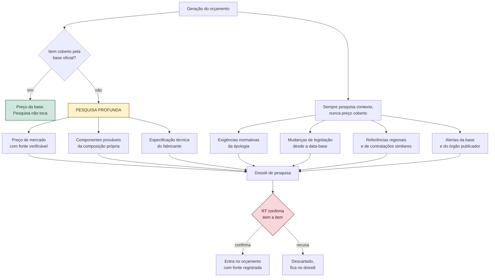
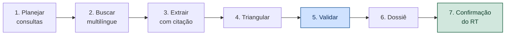

# VÉRTICE — Módulo de Pesquisa Profunda

**Versão:** 0.2
**Documento-pai:** `VERTICE-decisoes.md` — ADR-021 e ADR-022
**Relacionado:** `VERTICE-plataforma.md`, `VERTICE-modulo-cpu.md`, `VERTICE-agente-antagonista.md`

---

## 1. O que a pesquisa resolve, e o que ela estraga

A pesquisa profunda roda na geração do orçamento e ataca o que nenhuma base de referência cobre: sistema proprietário sem composição, exigência normativa da tipologia, referência regional de preço, mudança de legislação desde a última data-base.

E ela tem um jeito específico de estragar tudo: **pesquisar preço que a base oficial já responde**.

O caso está documentado. Na verificação de uma composição de contrapiso, um agregador público divulgava R$ 37,91. O valor oficial na mesma UF e mês era R$ 40,63 no regime onerado e R$ 39,37 no desonerado. O número do agregador não correspondia a nenhum dos dois. Uma pesquisa automática que encontrasse aquilo primeiro e o adotasse teria introduzido erro num documento assinado com responsabilidade técnica.

Daí a fronteira, que é do núcleo e nenhum pacote de domínio move:

> **A base oficial tem precedência absoluta sobre qualquer resultado de pesquisa, dentro da cobertura dela.**

A pesquisa atua no complemento, não na sobreposição.

---

## 2. Escopo



### 2.1 Sempre pesquisa

Mesmo quando todo item está coberto pela base, quatro frentes rodam em toda geração, porque são contexto e não preço:

- **Exigências normativas da tipologia** — o que a categoria de obra exige e pode ter ficado de fora do escopo.
- **Alterações de legislação e de regime tributário** desde a data-base adotada.
- **Contratações similares** publicadas, como referência de ordem de grandeza.
- **Comunicados do órgão publicador** da base sobre a referência em uso.

Esta é a frente mais valiosa e a menos óbvia. Ela não mexe em número: ela responde *"o que eu esqueci?"* — e é a pergunta que derruba orçamento em auditoria.

### 2.2 Nunca pesquisa

| Proibição | Motivo |
|-----------|--------|
| Preço de item coberto pela base oficial | Caso do contrapiso: risco de introduzir erro onde já havia acerto |
| Quantidade de qualquer item | Quantidade vem da geometria ou da memória. Sempre |
| Coeficiente sem documento que o sustente | Coeficiente inventado é número mágico. **Coeficiente publicado — norma, tabela técnica, especificação de fabricante — é achado legítimo**, sujeito aos mesmos sete portões e à confirmação do RT |
| Dado do projeto do cliente enviado como consulta | Sigilo. O que sai é termo técnico genérico, nunca identificação de obra ou cliente |

---

## 3. Pipeline

### ADR-022 — Pesquisa é proposta, nunca lançamento

Nenhum resultado entra no orçamento sozinho. Tudo vira **proposta com fonte**, confirmada item a item pelo responsável técnico. A confirmação é o que transforma achado em dado.



**1. Planejar.** O perfil de pesquisa do pacote de domínio define as frentes. O planejador monta consultas a partir da tipologia, da região, da data-base e dos itens sem cobertura. Consulta é gerada, não escrita à mão pelo usuário.

**2. Buscar em vários idiomas.** Português para norma e preço local. Inglês para especificação de fabricante e literatura técnica. Espanhol para referência regional latino-americana. Chinês para solução construtiva e tecnologia de execução, onde o mercado é o mais maduro em industrialização e medição automatizada.

O critério é funcional: **preço e norma são locais; técnica é global**. Buscar preço em chinês é inútil; buscar método executivo só em português é desperdiçar o que já foi resolvido.

**3. Extrair com citação.** Todo dado extraído carrega URL, título, data de publicação, data de acesso e o trecho que o sustenta. Sem os cinco, o achado é descartado antes de chegar ao dossiê.

**4. Triangular.** Valor proposto exige **no mínimo duas fontes independentes**. Mesmo domínio não conta como independente. Divergência acima da tolerância do perfil **não vira média** — vira pendência com as duas leituras expostas.

Média entre fontes discordantes é o pior resultado possível: produz um número que nenhuma fonte sustenta e que parece consensual.

**5. Validar.** Sete portões, todos eliminatórios:

| # | Verificação |
|---|-------------|
| 1 | URL acessível e citável |
| 2 | Data de publicação dentro da janela do perfil |
| 3 | Unidade compatível com a do item |
| 4 | Ordem de grandeza compatível com itens similares da base |
| 5 | Moeda e data-base declaradas |
| 6 | Fonte fora da lista de bloqueio do perfil |
| 7 | Cadeia de proveniência resolvível: documento, citação, data de acesso e corroboração |

O portão 7 é o mais importante. **Número que o modelo escreveu e nenhum documento sustenta é número mágico e é descartado**, mesmo parecendo razoável. É a regra da §1.1 da arquitetura aplicada à pesquisa: o que qualifica um valor não é plausibilidade, é origem.

Aprovado nos sete portões, o achado vai ao antagonista, que emite veredito antes de a proposta chegar ao RT. São duas barreiras independentes sobre o mesmo valor.

**6. Dossiê.** Documento único, anexo ao orçamento.

**7. Confirmação.** O RT percorre proposta a proposta. O que ele confirma entra com a fonte já registrada. O que recusa permanece no dossiê como alternativa avaliada — informação que vale em auditoria.

---

## 4. Dossiê

```sql
CREATE TABLE dossie (
    id              INTEGER PRIMARY KEY,
    id_projeto      INTEGER NOT NULL REFERENCES projeto(id),
    gerado_em       TEXT NOT NULL,
    perfil          TEXT NOT NULL,
    idiomas         TEXT NOT NULL,
    consultas       TEXT NOT NULL,        -- JSON: o que foi perguntado
    modo            TEXT NOT NULL CHECK (modo IN ('COMPLETO','CACHE','OFFLINE'))
);

CREATE TABLE achado (
    id              INTEGER PRIMARY KEY,
    id_dossie       INTEGER NOT NULL REFERENCES dossie(id),
    frente          TEXT NOT NULL,        -- NORMATIVO, PRECO, COMPONENTE, LEGISLACAO, SIMILAR
    alvo            TEXT,                 -- item a que se refere, quando houver
    afirmacao       TEXT NOT NULL,
    valor           TEXT,                 -- decimal exato; NULL se não numérico
    unidade         TEXT,
    moeda           TEXT,
    data_base       TEXT,
    url             TEXT NOT NULL,
    titulo          TEXT NOT NULL,
    idioma          TEXT NOT NULL,
    publicado_em    TEXT,
    acessado_em     TEXT NOT NULL,
    trecho          TEXT NOT NULL,
    confiabilidade  TEXT NOT NULL,
    corroborado_por INTEGER,              -- quantas fontes independentes
    situacao        TEXT NOT NULL CHECK (situacao IN
                       ('PROPOSTO','CONFIRMADO','RECUSADO','DIVERGENTE'))
);
```

`url` e `trecho` são `NOT NULL`. Achado sem documento que o sustente não é achado — é opinião do modelo.

---

## 5. Custo, latência e cache

Pesquisa profunda a cada geração seria lenta e cara sem disciplina. Três mecanismos:

- **Cache por chave** `(domínio, tipologia, região, data-base, frente)`, com prazo de validade por frente: exigência normativa dura meses, preço de mercado dura dias.
- **Execução incremental.** Segunda geração do mesmo projeto pesquisa apenas o que mudou: itens novos, itens sem cobertura e frentes vencidas.
- **Orçamento de consultas por geração**, configurável. Estourado o limite, o dossiê declara o que ficou de fora em vez de cortar em silêncio.

Referência de projeto: primeira geração até 90 segundos, geração incremental abaixo de 15.

O dossiê sempre declara o modo em que rodou: completo, cache ou offline. Um orçamento gerado sem rede precisa dizer isso na cara do usuário.

---

## 6. Degradação sem rede

O aplicativo é offline-first e isso não muda. Sem rede:

- Todo o resto funciona: base, quantitativos, composições próprias, markup, antagonista nas camadas 1 e 3, exportação.
- O dossiê é gerado em modo offline, com o cache disponível e a declaração explícita do que não foi verificado.
- Itens sem cobertura viram **pendência**, não estimativa. A ausência de pesquisa nunca produz número.

No modo sem IA — requisito de contrato em cliente com sigilo — a pesquisa é desligada por inteiro, e o comportamento é idêntico ao offline.

---

## 7. Sigilo

O que sai da máquina são termos técnicos genéricos: tipo de sistema, norma, região, unidade. **Nunca** nome de cliente, endereço, nome de arquivo, texto de carimbo, dado de projeto ou trecho de memorial.

Um filtro percorre toda consulta antes do envio. Consulta que contenha identificador do projeto é bloqueada e registrada como incidente — não reescrita automaticamente, porque reescrever esconde o erro de quem o programou.

---

## 8. Integração com os outros módulos

| Módulo | Relação |
|--------|---------|
| Composição própria | Pesquisa alimenta componentes e preços candidatos. Coeficiente continua sendo do RT |
| Pendências | Item sem cobertura e sem achado confiável vira pendência com o que foi tentado |
| Antagonista | Achado normativo que aponte serviço ausente gera objeção `A-ESC-01` |
| Fontes | Achado confirmado vira registro de fonte automaticamente, com data de acesso |
| Base de referência | Comunicado sobre a base gera alerta na próxima importação |

O vínculo com o antagonista é o mais produtivo: a pesquisa descobre que a tipologia exige um serviço, o antagonista verifica que ele não está no orçamento, e o RT recebe a objeção com a citação normativa anexa.

---

## 9. Testes de aceite

| # | Cenário | Esperado |
|---|---------|----------|
| R01 | Item coberto pela base oficial | Pesquisa não propõe preço para ele |
| R02 | Fonte externa divergindo da base oficial | Base prevalece; divergência apenas registrada no dossiê |
| R03 | Achado sem URL ou sem trecho | Descartado antes do dossiê |
| R04 | Valor com fonte única | Marcado como não corroborado, jamais confirmado automaticamente |
| R05 | Duas fontes com diferença acima da tolerância | Pendência com as duas leituras; nunca média |
| R06 | Valor produzido pelo modelo sem documento | Descartado no portão 7 |
| R07 | Consulta contendo nome do cliente | Bloqueada e registrada como incidente |
| R08 | Geração sem rede | Dossiê em modo offline, com o não verificado declarado |
| R09 | Segunda geração do mesmo projeto | Incremental, abaixo de 15 segundos |
| R10 | Orçamento de consultas estourado | Dossiê declara o que ficou de fora |
| R11 | Achado normativo de serviço ausente | `A-ESC-01` com a citação anexa |
| R12 | Achado confirmado pelo RT | Vira fonte com data de acesso, sem redigitação |
| R13 | Achado recusado | Permanece no dossiê como alternativa avaliada |
| R14 | Modo sem IA | Pesquisa integralmente desligada, sem tráfego |

---

## 10. Histórico

| Versão | Data | Alteração |
|--------|------|-----------|
| 0.2 | 13/09/2026 | Coeficiente documentado passa a ser achado legítimo. Portão 7 reescrito como cadeia de proveniência. Antagonista incluído como segunda barreira sobre o achado |
| 0.1 | 13/09/2026 | Documento inicial. Pesquisa profunda na geração, restrita ao complemento da base oficial. Triangulação obrigatória, sete portões de validação, dossiê citável e confirmação item a item pelo RT |
