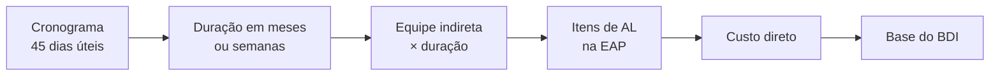

# VÉRTICE — Módulo de Precificação

**Versão:** 0.1
**Documento-pai:** `VERTICE-arquitetura.md`
**Relacionado:** `VERTICE-agente-antagonista.md` (regras `A-BDI-*`, `A-AL-*`, `A-TAX-*`, `A-RES-*`)
**Modelo de referência:** orçamento auditado do CME da Santa Casa de Cerqueira César

---

## 1. Por que este documento existe

As duas primeiras versões da arquitetura tratavam BDI, encargos e administração local como uma linha de tabela. Confrontando os documentos com a planilha real, essa era a maior lacuna do projeto.

O custo direto é a parte fácil: vem da base SINAPI, é verificável código a código, e a verificação contra a base oficial de 07/2026 fechou com zero divergências. **É de BDI, administração local e taxas que orçamento apanha em auditoria** — não de preço unitário de alvenaria.

Este documento especifica a travessia entre custo direto e preço final.


---

## 2. Regime de encargos

### 2.1 A escolha que contamina tudo

Todo preço do SINAPI existe em três versões, e escolher errado invalida o orçamento inteiro:

| Regime | Aba do arquivo oficial | O que significa |
|--------|------------------------|-----------------|
| Onerado | `CSD` / `ISD` | Contribuição previdenciária sobre a folha |
| Desonerado | `CCD` / `ICD` | Contribuição sobre a receita bruta |
| Sem encargos | `CSE` / `ISE` | Custo sem encargos sociais, para composição própria |

No orçamento do CME, a diferença entre regimes chega a 7% em mão de obra: o servente com encargos custa R$ 32,18 no onerado e R$ 30,48 no desonerado.

### 2.2 Regras do app

1. **Regime é obrigatório na criação do orçamento.** Sem padrão silencioso, sem herdar do anterior.
2. **Aparece em todo cabeçalho** de aba exportada, junto com base, UF e data-base.
3. **Não pode ser trocado sem recálculo explícito**, com comparativo antes e depois item a item.
4. **Contraprova permanente:** a aba de auditoria mostra o valor no regime oposto na coluna vizinha. É o erro mais comum e o mais difícil de enxergar sem os dois números lado a lado.
5. **CPRB coerente com o regime.** Em orçamento onerado, a contribuição sobre receita bruta no quadro de BDI é zero. Cobrar CPRB sobre preço onerado é dupla contagem.

### 2.3 Pendência legal

O regime de desoneração da folha na construção civil passou por alteração legislativa com transição prevista para o período de 2025 a 2027. **O app não embute interpretação jurídica.** Ele registra o regime escolhido, a data-base e a fonte, e deixa o enquadramento com o responsável técnico.

Recomendo confirmar a regra vigente na data-base de cada orçamento antes de fechar — é matéria em transição e não cabe cristalizar num software.

---

## 3. BDI analítico

### 3.1 Nunca um número solto

Colocar "BDI: 23,62%" numa célula é o convite mais direto a glosa que existe. O BDI precisa ser **composto, com cada parcela justificada e fonte declarada**.

Fórmula adotada, a mesma da referência do TCU:

```text
BDI = [ (1 + AC + SG + R) × (1 + DF) × (1 + L) ] ÷ [ 1 − (PIS + COFINS + ISS + CPRB) ] − 1
```

| Símbolo | Componente | Natureza |
|---------|-----------|----------|
| `AC` | Administração central | Despesa indireta |
| `SG` | Seguro e garantia | Despesa indireta |
| `R` | Risco | Despesa indireta |
| `DF` | Despesas financeiras | Custo de capital de giro |
| `L` | Lucro | Remuneração |
| `PIS`, `COFINS`, `ISS`, `CPRB` | Tributos sobre faturamento | Incidem sobre o preço, por isso dividem |

O denominador é o detalhe que mais se erra: tributos sobre faturamento **não somam**, eles dividem. Somá-los subestima o preço necessário para que a receita líquida feche.

### 3.2 Quadro do CME como referência de teste

| Componente | Valor |
|-----------|------:|
| Administração central | 4,01% |
| Seguro e garantia | 0,32% |
| Risco | 0,50% |
| Despesas financeiras | 1,02% |
| Lucro | 6,64% |
| PIS | 0,65% |
| COFINS | 3,00% |
| ISS (Cerqueira César) | 5,00% |
| CPRB | 0,00% |
| **BDI resultante** | **23,6245%** |

Serve de caso de teste de regressão do motor: essas entradas precisam produzir exatamente esse resultado.

### 3.3 Faixas de referência

O app compara o BDI composto com as faixas de referência do Acórdão 2622/2013 do TCU e sinaliza posição, sem bloquear:

| Referência | Valor |
|-----------|------:|
| 1º quartil | 20,34% |
| Médio | 22,12% |
| 3º quartil | 25,00% |

Ficar acima do 3º quartil é legítimo desde que justificado. O app exige a justificativa escrita, que vai para o relatório. Bloquear seria arrogância do software; deixar passar em silêncio seria negligência.

### 3.4 ISS e a base de cálculo

A alíquota é municipal e a base varia: alguns municípios permitem dedução de material, outros não. O app guarda **alíquota, município, base aplicada e fonte da legislação**. No CME é alíquota cheia de 5% com base de 100%, conforme quadro municipal.

### 3.5 Modelo de dados

```sql
CREATE TABLE bdi (
    id_orcamento    INTEGER PRIMARY KEY REFERENCES orcamento(id),
    administracao_central TEXT NOT NULL,   -- percentual decimal; arquitetura §5.1
    seguro_garantia       TEXT NOT NULL,
    risco                 TEXT NOT NULL,
    despesas_financeiras  TEXT NOT NULL,
    lucro                 TEXT NOT NULL,
    pis                   TEXT NOT NULL,
    cofins                TEXT NOT NULL,
    iss                   TEXT NOT NULL,
    cprb                  TEXT NOT NULL,
    municipio_iss         TEXT NOT NULL,
    base_iss              TEXT NOT NULL,
    justificativa         TEXT,
    id_fonte              INTEGER REFERENCES fonte(id),
    id_origem             TEXT NOT NULL    -- formato em arquitetura §4.1
);
```

O percentual resultante **não é coluna**. É função das parcelas, calculada sempre. Guardar o resultado permitiria que ele divergisse das entradas — que é exatamente como planilha antiga passa a mentir.

---

## 4. Administração local

### 4.1 O erro clássico

Administração local é a equipe e a estrutura que ficam na obra: encarregado, engenheiro residente, contêiner, vigilância. Muito orçamento joga isso dentro do BDI como percentual.

A orientação de controle é outra: **AL é item mensurável da planilha**, quantificado por equipe e prazo, não percentual embutido. A razão é prática — se a obra atrasa, a AL cresce proporcionalmente ao tempo, enquanto um percentual de BDI fica congelado.

### 4.2 Regras do app

- AL é grupo próprio da EAP, com itens de mão de obra indireta e estrutura, quantificados em meses ou dias.
- A quantidade **vem do cronograma**, não é digitada solta. Cronograma de 45 dias úteis gera 9 semanas de encarregado, e mudar o cronograma reflete na AL.
- **AL zerada é permitida, mas exige justificativa escrita.** No CME ela é zero porque a fiscalização e a responsabilidade técnica ficam com o contratante, e isso está declarado. Zero sem justificativa dispara alerta no relatório.
- O quadro de BDI exibe indicador explícito de que a AL está fora dele, com o valor correspondente.

### 4.3 Ligação com o cronograma



Se a AL entrasse no BDI, essa cadeia não existiria e o atraso de obra viraria prejuízo silencioso.

---

## 5. Taxas, licenças e responsabilidade técnica

### 5.1 Fora do BDI, fora do custo direto

ART, licenças municipais, vigilância sanitária e corpo de bombeiros não são custo de execução nem despesa indireta de empresa. São desembolsos específicos, e entram depois do BDI.

### 5.2 O padrão que a planilha já acertou

O modelo separa **valor confirmado** de **valor informativo**, e só o confirmado compõe o total:

| Item | Órgão | Confirmado | Informativo | Compõe? | Situação |
|------|-------|-----------:|------------:|---------|----------|
| ART | CREA-SP | 285,59 | 285,59 | Sim | Confirmado |
| Licença de reforma | Prefeitura | 0,00 | 30,68 | Não | A confirmar |
| Atualização sanitária | VISA municipal | 0,00 | 0,00 | Não | A confirmar |
| AVCB/CLCB | Corpo de Bombeiros | 0,00 | 0,00 | Não | Condicional |
| Habite-se | Prefeitura | 0,00 | 0,00 | Não | Condicional |

Essa distinção é o coração da honestidade do orçamento: **valor sem guia oficial não entra no total, mas também não desaparece**. Fica visível, com ação nomeada e responsável.

### 5.3 Regras do app

- Situações: `CONFIRMADO`, `A CONFIRMAR`, `CONDICIONAL`, `INFORMATIVO`.
- Só `CONFIRMADO` soma. As demais aparecem no relatório com o valor informativo entre parênteses.
- Todo item exige órgão, critério e fonte. Taxa sem fonte não é cadastrável.
- A ART é sugerida automaticamente quando o valor do contrato ultrapassa a faixa de obrigatoriedade, com o valor da tabela vigente do conselho.

---

## 6. Resíduos

Grupo próprio, porque é onde orçamento de reforma erra por subestimar volume.

### 6.1 Cadeia de cálculo

```text
volume in situ  →  × fator de empolamento  →  volume solto
volume solto    →  transporte interno / ensacamento
volume solto    →  ÷ capacidade da caçamba  →  quantidade de caçambas
```

No CME: 2,4311 m³ in situ, fator 1,50, resultando em 3,6466 m³ soltos; transporte manual ensacado a R$ 121,16/m³ e duas caçambas de 4 m³ a R$ 500,00, totalizando R$ 1.441,83.

### 6.2 Cuidados

- **O fator de empolamento é premissa editável, nunca constante de código.** Varia com o material: alvenaria não empola como concreto armado.
- **Quantidade de caçambas arredonda para cima e admite adicional de acabamento.** Meia caçamba não existe.
- A destinação final e o controle de transporte de resíduos precisam constar, mesmo quando embutidos no preço da caçamba. Obra hospitalar tem fiscalização ambiental própria.
- Demolição em hospital em operação muda o cenário: retirada diária, sem acúmulo em pátio. Isso é premissa, e premissa que altera preço precisa estar escrita.

---

## 7. Cronograma físico-financeiro

### 7.1 O que a planilha já faz bem

Onze atividades em 45 dias úteis, com predecessora, equipe-chave e marcação de hospital em operação por atividade. Essa última coluna é diferencial real: obra em unidade funcionando tem produtividade menor, e isso justifica coeficiente diferente do padrão SINAPI.

### 7.2 Regras do app

- Atividade tem duração em dias úteis, predecessoras, equipe-chave e vínculo com grupo de custo.
- A duração total **alimenta a administração local** (§4.3).
- A distribuição financeira por período gera a curva S, derivada do cronograma e do custo de cada grupo — não digitada.
- A marcação de unidade em operação é um sinalizador por atividade, que aparece no relatório como premissa de produtividade.

### 7.3 Limite honesto

Cronograma com predecessora não é caminho crítico. Calcular folga, caminho crítico e nivelamento de recursos é escopo de software de planejamento, e não é o que o VÉRTICE se propõe a ser. A F4 entrega sequência e distribuição financeira. Quem precisa de PERT/CPM usa ferramenta de planejamento.

---

## 8. Curva ABC

Ordenação decrescente por peso financeiro, com faixas configuráveis — o padrão sugerido é 50% em A, 30% em B e 20% em C sobre o custo acumulado.

Serve a três usos: foco de negociação, foco de conferência e leitura de risco de concentração. No CME, poucos itens concentram a maior parte do custo, e é exatamente onde vale gastar tempo de verificação.

A curva é derivada, sempre recalculada. Nunca armazenada.

---

## 9. Sensibilidade

Cenários comparativos sobre o mesmo custo direto: variação de BDI pelas faixas do TCU, variação de escopo — no CME, a inclusão ou não dos ambientes semicríticos — e variação percentual sobre o conjunto de CPUs.

**Lição aprendida na auditoria da planilha, que vira requisito:** os cenários são o lugar onde erro se esconde. O orçamento oficial estava correto, mas a fórmula de um cenário alternativo apontava para a CPU errada e superestimava o resultado em cerca de R$ 19,4 mil. Ninguém percebeu porque o número do dia a dia estava certo — o errado era justamente o que a análise existe para embasar.

Requisito derivado: **todo cenário é recalculado a partir do mesmo motor do orçamento oficial**, nunca por fórmula paralela escrita à mão. Cenário que duplica lógica é cenário que vai divergir.

---

## 10. Pendências e escopo

Itens sem base técnica **não são precificados por estimativa**. Vão para o quadro de pendências, fora do total, com prioridade, decisão adotada, impacto e responsável.

No CME, instalações elétricas, hidráulicas e gases medicinais ficaram fora por ausência de projeto executivo — declarado, não escondido. É o mesmo caminho de quem recusa autorizar uma CPU (`VERTICE-modulo-cpu.md` §3.2).

O relatório final traz o quadro de pendências logo após o total. Orçamento que omite o que não foi orçado é orçamento que mente por omissão.

---

## 11. Testes de aceite

| # | Cenário | Esperado |
|---|---------|----------|
| P01 | BDI com as parcelas do CME | 23,6245%, conferindo com a planilha auditada |
| P02 | Tributos somados em vez de divididos | Impossível: a fórmula é única no motor, sem variante |
| P03 | Orçamento onerado com CPRB maior que zero | Alerta de incoerência de regime |
| P04 | BDI acima do 3º quartil do TCU | Exige justificativa escrita antes de exportar |
| P05 | AL zerada sem justificativa | Alerta no relatório |
| P06 | Cronograma alterado de 45 para 60 dias | Quantidade de AL recalcula proporcionalmente |
| P07 | Taxa com situação "A confirmar" | Não soma ao total, aparece como informativo |
| P08 | Contrato acima da faixa de ART | Item de ART sugerido automaticamente |
| P09 | Volume de entulho com fator de empolamento alterado | Caçambas recalculam com arredondamento para cima |
| P10 | Cenário de sensibilidade | Usa o mesmo motor do orçamento oficial, sem fórmula paralela |
| P11 | Troca de regime com orçamento pronto | Exige confirmação e mostra comparativo item a item |
| P12 | Reconstrução do orçamento do CME | Preço final de R$ 141.194,42 |

---

## 12. Histórico

| Versão | Data | Alteração |
|--------|------|-----------|
| 0.1 | 13/09/2026 | Documento inicial. Criado na revisão da arquitetura, ao constatar que BDI, administração local, taxas, resíduos e cronograma estavam sem especificação apesar de existirem na planilha-modelo |
