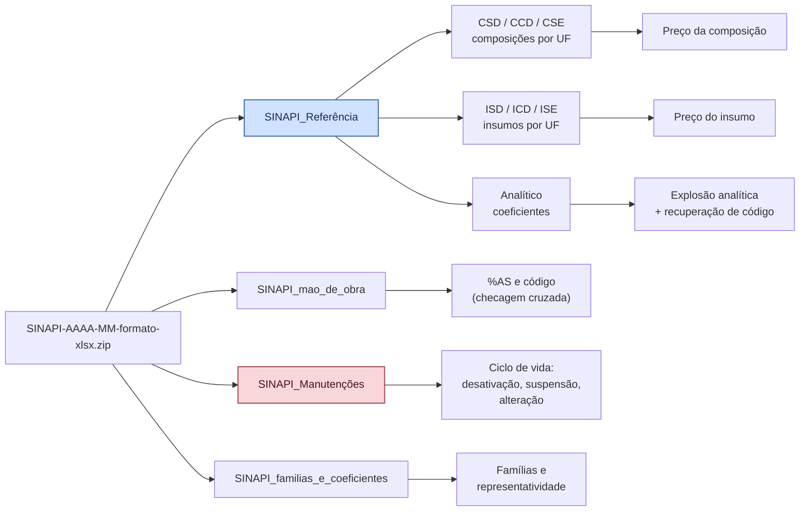
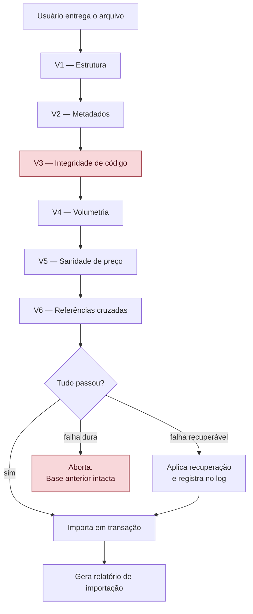

# VÉRTICE — Módulo de Base SINAPI

**Versão:** 0.3
**Documento-pai:** `VERTICE-decisoes.md` — ADR-008
**Relacionado:** `VERTICE-modulo-cpu.md` (gatilho G3), `VERTICE-modulo-precificacao.md` (regime de encargos)
**Base de referência analisada:** `SINAPI-2026-07-formato-xlsx.zip` (Caixa/IBGE, emissão 11/08/2026)

---

## 1. Decisão de arquitetura

> **O VÉRTICE não baixa a base. O usuário entrega a base.**

A versão anterior deste projeto previa um ETL que buscaria as planilhas no site da Caixa automaticamente. Depois de trabalhar com o arquivo real, essa decisão está revista.

| Motivo | Detalhe |
|--------|---------|
| Não há API nem URL estável | A Caixa publica por navegação, e o caminho muda. Um raspador quebraria a cada mudança de layout do site |
| O orçamentista já faz esse download | É rotina mensal dele. Não estamos economizando um passo que ele não dê |
| Offline-first de verdade | O app funciona em obra, em máquina sem internet, em rede hospitalar restrita |
| Rastreabilidade | O arquivo importado fica registrado com nome, data de emissão e hash. Em auditoria, dá para provar exatamente qual base gerou aquele orçamento |
| Responsabilidade | Se o app baixasse sozinho, um erro de download viraria erro de orçamento sem ninguém perceber |

O usuário arrasta o `.zip` ou os `.xlsx` soltos. O app faz o resto.

---

## 2. Anatomia real do pacote

O pacote mensal traz quatro arquivos. Cada um alimenta uma parte diferente do app.



### 2.1 `SINAPI_Referência` — o núcleo

| Aba | Conteúdo | Linhas (07/2026) |
|-----|----------|-----------------:|
| `CSD` | Composições **sem** desoneração (onerado) | 10.544 |
| `CCD` | Composições **com** desoneração | 10.544 |
| `CSE` | Composições **sem** encargos sociais | 10.544 |
| `ISD` / `ICD` / `ISE` | Insumos, mesma lógica de regime | 4.875 |
| `Analítico` | Composição → itens com coeficiente | 66.870 |
| `Menu` / `Busca` | Navegação — ignorar | — |

**O layout muda entre composições e insumos. O parser precisa tratar os dois casos:**

| | Composições (CSD/CCD/CSE) | Insumos (ISD/ICD/ISE) |
|---|---|---|
| Linha das UFs | 9 | 10 |
| Linha dos cabeçalhos | 10 | 11 |
| Colunas por UF | **duas**: `Custo (R$)` + `%AS` | **uma**: `Custo (R$)` |
| Índice da coluna SP | 54 | 30 |
| Colunas iniciais | Grupo, Código, Descrição, Unidade | Classificação, Código, Descrição, Unidade, Origem de Preço |

Nunca fixar o índice da coluna no código. **Localizar a UF pela linha de cabeçalho** e derivar o índice — é a única forma de sobreviver a uma mudança de layout.

### 2.2 Metadados vêm do próprio arquivo

As células de cabeçalho carregam tudo que o app precisa para identificar a base, sem perguntar nada ao usuário:

- `Mês de Referência:` → `07/2026`
- `Data de emissão:` → `11/08/2026`
- `Encargos sociais sobre (SEM DESONERAÇÃO)` → o regime da aba
- Linha de `%AS` → porcentagem atribuída, que indica composições com preço parcialmente estimado

### 2.3 `Analítico` — subestimada e essencial

Estrutura: `Grupo | Código da Composição | Tipo Item | Código do Item | Descrição | Unidade | Coeficiente | Situação`

Linhas com `Tipo Item` vazio são o **cabeçalho da composição**; as seguintes são seus itens, marcados como `COMPOSICAO` ou `INSUMO`. É o que permite a explosão recursiva — e, como se viu, também serve de âncora para recuperar códigos perdidos.

A coluna `Situação` traz o vocabulário oficial: `COM CUSTO`, `SEM CUSTO`, `COM PREÇO`, `SEM PREÇO`, `EM ESTUDO`. Esses estados devem ser importados como estão, não normalizados.

### 2.4 `SINAPI_Manutenções` — o arquivo que ninguém lê

32.235 registros no acumulado de 07/2026, com o histórico completo de mudanças:

| Tipo de manutenção | Ocorrências | Consequência no app |
|--------------------|------------:|---------------------|
| Criação de composição com custo | 9.587 | informativo |
| **Desativação** | 6.232 | **bloqueia uso em orçamento novo** |
| Alteração de descrição | 6.095 | alerta: revalidar justificativa de não equivalência |
| Alteração de itens/coeficientes | 3.370 | alerta: composição mudou de conteúdo |
| **Composição suspensa** | 141 | **bloqueia uso** |
| Alteração de unidade | 10 | **crítico: invalida o quantitativo** |

Sem importar este arquivo, o app deixa o orçamentista usar uma composição desativada sem qualquer aviso.

### 2.5 `SINAPI_mao_de_obra` e `familias_e_coeficientes`

O primeiro traz `%AS` por composição e UF — e, importante, **preserva o código da composição**, servindo de segunda fonte de verdade. O segundo traz famílias de insumos com marcação `REPRESENTATIVO` / `REPRESENTADO`, útil para busca por similaridade na hora de sugerir substitutos.

---

## 3. Validação de importação

Aprendizado direto do arquivo real: **a base pode chegar quebrada e parecer perfeita**.

No pacote de 07/2026 analisado, a coluna "Código da Composição" das abas `CSD`, `CCD` e `CSE` veio **inteiramente zerada** — 10.544 linhas com código `0`. Descrições, unidades e preços íntegros. Uma importação ingênua criaria dez mil composições de código zero, e o erro só apareceria muito depois, quando nenhum vínculo de orçamento funcionasse.

### 3.1 Portões de validação, em ordem



| Portão | Verifica | Falha |
|--------|----------|-------|
| **V1** | Abas esperadas existem; linha de UF localizável; colunas nomeadas | Dura |
| **V2** | Mês de referência e regime legíveis no cabeçalho | Dura |
| **V3** | Coluna de código tem cardinalidade compatível com o número de linhas | **Recuperável** — ver §3.2 |
| **V4** | Contagem de itens dentro de ±5% do mês anterior | Alerta, exige confirmação |
| **V5** | Preços não negativos; zeros contados e reportados (são legítimos: composição ativa sem custo na UF) | Alerta |
| **V6** | Todo `Código do Item` do Analítico existe em composições ou insumos | Alerta com lista |

**V3 é o portão que o incidente real justifica.** A regra: se a coluna de código tiver menos de 90% de valores distintos em relação ao número de linhas, ela está corrompida.

### 3.2 Recuperação de código

Quando V3 falha, o app não aborta — recupera, porque o dado existe em outro lugar do mesmo pacote:

1. **Via `Analítico`** — chave `descrição + unidade`. No arquivo de 07/2026 isso retornou 10.544 correspondências com **zero chaves duplicadas**, ou seja, mapeamento unívoco.
2. **Via `mao_de_obra`** — mesma chave, fonte independente.
3. **Conferência cruzada** — os dois caminhos devem concordar. Divergência em qualquer item aborta a importação.

O relatório de importação registra que houve recuperação, por qual caminho, e quantos itens. Isso vai para a aba de fontes do orçamento: **auditoria precisa saber que a base foi reconstruída**.

---

## 4. Modelo de dados

```sql
-- Cada importação é uma base versionada e imutável
CREATE TABLE base_referencia (
    id                  INTEGER PRIMARY KEY,
    mes_referencia      TEXT NOT NULL,          -- '2026-07'
    data_emissao        TEXT NOT NULL,          -- lida do cabeçalho
    arquivo_nome        TEXT NOT NULL,
    arquivo_hash        TEXT NOT NULL,          -- SHA-256, prova de qual arquivo gerou o orçamento
    importado_em        TEXT NOT NULL,
    codigo_recuperado   INTEGER NOT NULL DEFAULT 0,   -- 0/1
    metodo_recuperacao  TEXT,                   -- 'ANALITICO', 'MAO_DE_OBRA', NULL
    total_composicoes   INTEGER NOT NULL,
    total_insumos       INTEGER NOT NULL,
    UNIQUE (mes_referencia, arquivo_hash)
);

CREATE TABLE item_sinapi (
    id_base        INTEGER NOT NULL REFERENCES base_referencia(id),
    codigo         TEXT NOT NULL,
    tipo           TEXT NOT NULL CHECK (tipo IN ('COMPOSICAO','INSUMO')),
    grupo          TEXT,
    descricao      TEXT NOT NULL,
    unidade        TEXT NOT NULL,
    situacao       TEXT,                        -- COM CUSTO / SEM CUSTO / EM ESTUDO...
    PRIMARY KEY (id_base, codigo, tipo)
);

CREATE TABLE preco_sinapi (
    id_base        INTEGER NOT NULL,
    codigo         TEXT NOT NULL,
    tipo           TEXT NOT NULL,
    uf             TEXT NOT NULL,
    regime         TEXT NOT NULL CHECK (regime IN ('ONERADO','DESONERADO','SEM_ENCARGOS')),
    valor_centavos INTEGER,                     -- NULL quando não divulgado na UF
    percentual_as  TEXT,                        -- %AS, só para composições
    PRIMARY KEY (id_base, codigo, tipo, uf, regime)
);

CREATE TABLE composicao_item (
    id_base           INTEGER NOT NULL,
    codigo_composicao TEXT NOT NULL,
    tipo_item         TEXT NOT NULL CHECK (tipo_item IN ('COMPOSICAO','INSUMO')),
    codigo_item       TEXT NOT NULL,
    coeficiente       TEXT NOT NULL,            -- decimal exato; arquitetura §5.1
    situacao          TEXT,
    PRIMARY KEY (id_base, codigo_composicao, tipo_item, codigo_item)
);

CREATE TABLE manutencao_sinapi (
    id_base      INTEGER NOT NULL,
    referencia   TEXT NOT NULL,                 -- mês da manutenção
    tipo         TEXT NOT NULL,
    codigo       TEXT NOT NULL,
    descricao    TEXT,
    manutencao   TEXT NOT NULL
);

CREATE INDEX idx_manut_codigo ON manutencao_sinapi (id_base, codigo);
```

**Ponto de projeto:** `id_base` em toda tabela. Bases coexistem. Um orçamento aponta para uma base específica e **nunca muda de preço sozinho** quando uma nova é importada. Reajustar é ato deliberado do usuário, com comparativo antes e depois.

---

## 5. Busca

A tabela FTS5 é derivada, reconstruída a cada importação:

```sql
CREATE VIRTUAL TABLE busca_sinapi USING fts5(
    codigo, descricao, grupo, unidade, tipo, id_base UNINDEXED,
    tokenize = 'unicode61 remove_diacritics 2'
);
```

`remove_diacritics 2` é obrigatório: ninguém digita "IMPERMEABILIZAÇÃO" com cedilha e til numa busca rápida.

A busca ordena por relevância textual, mas **rebaixa** itens sem preço na UF selecionada e itens desativados — eles aparecem, marcados, nunca escondidos. Esconder faria o orçamentista achar que o código não existe.

---

## 6. Explosão analítica

A partir de `composicao_item`, recursiva, com profundidade máxima e detecção de ciclo:

```text
custo(composição) = Σ [ coeficiente(item) × preço(item, uf, regime) ]
  onde item COMPOSICAO recursa; item INSUMO resolve direto
```

Três armadilhas reais:

1. **Ciclo** — composição que referencia a si mesma por cadeia. Limite de profundidade e conjunto de visitados; ciclo detectado é erro de importação, não de cálculo.
2. **Item sem preço na UF** — a explosão não pode retornar zero silenciosamente. Retorna parcial e marca a composição como "custo incompleto em SP".
3. **Divergência de arredondamento** — a soma explodida pode não bater exatamente com o custo sintético publicado, por arredondamento na origem. O app compara os dois e mostra a diferença; não "corrige" nenhum dos lados.

---

## 7. Ciclo de vida dos códigos

Ao importar `Manutenções`, cada código do orçamento aberto é confrontado:

| Situação | Comportamento |
|----------|---------------|
| `DESATIVAÇÃO` ou `COMPOSIÇÃO SUSPENSA` | Bloqueia inclusão em orçamento novo. Em orçamento existente, marca em vermelho e exige decisão |
| `ALTERAÇÃO DE UNIDADE` | **Crítico.** O quantitativo casado com a composição perde sentido. Bloqueia e exige remedição |
| `ALTERAÇÃO DE ITENS/COEFICIENTES` | Alerta: o conteúdo da composição mudou. Se ela embasou uma justificativa de não equivalência para uma CPU, a justificativa precisa ser revalidada |
| `ALTERAÇÃO DE DESCRIÇÃO` | Alerta brando, com o texto antigo e o novo lado a lado |
| `CRIAÇÃO DE COMPOSIÇÃO SEM CUSTO` | Explica por que um código existe mas não tem preço na UF — exatamente o caso que justifica CPU provisória por gatilho G3 |

Essa integração fecha o laço com o módulo de CPU: o gatilho **G3 (sem preço na UF)** deixa de ser preenchido à mão e passa a ser **detectado pela base**.

---

## 8. Ciclo mensal

A base é publicada mensalmente. O aplicativo **pede a nova base todo dia 12**, configurável, e não deixa o pedido morrer em silêncio.

| Dia | Comportamento |
|-----|---------------|
| 12 | Aviso na abertura: "A referência de <mês> deve estar publicada. Carregar o pacote?" com atalho para a página oficial |
| 12 em diante | Aviso permanece a cada abertura até a importação, com contador de dias |
| Após 30 dias sem importar | Todo orçamento novo nasce com faixa de alerta: "data-base defasada em N meses" |
| Importação concluída | Aviso cessa; orçamentos abertos recebem a reavaliação da §7 |

O lembrete **nunca importa sozinho** e **nunca troca a base de um orçamento existente**. Ele só pede. A ADR-008 continua valendo: o usuário entrega, o app registra o hash.

Um detalhe de interface que evita ruído: o aviso pode ser adiado por sete dias, no máximo duas vezes. Depois disso ele fica fixo. Adiamento ilimitado é o mesmo que não ter lembrete.

## 10. Assistente de importação

```mermaid
sequenceDiagram
    participant U as Usuário
    participant A as VÉRTICE
    participant B as SQLite

    U->>A: arrasta o .zip do mês
    A->>A: descompacta e identifica os 4 arquivos
    A->>U: "SINAPI 07/2026, emitido em 11/08/2026.<br/>Confirma?"
    U->>A: confirma
    A->>A: executa V1 a V6
    alt validação limpa
        A->>B: importa em transação
    else código corrompido
        A->>U: "Coluna de código inconsistente.<br/>Recuperar pelo Analítico?"
        U->>A: autoriza
        A->>A: recupera e confere contra mao_de_obra
        A->>B: importa e registra a recuperação
    else falha dura
        A->>U: aborta e explica; base anterior intacta
    end
    A->>U: relatório de importação
```

O relatório final traz: mês, emissão, hash, totais por tipo, itens sem preço em SP, códigos desativados que aparecem em orçamentos abertos, e — se houve — o registro da recuperação de código.

**Nunca importar em silêncio.** Base de preço trocada sem aviso é a origem clássica do orçamento que "mudou sozinho".

---

## 10. Auditoria gerada pelo app

O app reproduz, automaticamente, a aba de auditoria que hoje se faz à mão:

| Coluna | Origem |
|--------|--------|
| Código, tipo, descrição, unidade | base importada |
| Valor adotado na planilha | orçamento |
| Valor oficial na UF e regime | base importada |
| Diferença | calculada, vazia quando não há valor adotado |
| Valor no regime oposto | contraprova — evita a confusão onerado/desonerado |
| Situação de manutenção | arquivo de manutenções |
| Fonte | nome do arquivo, aba, coluna, data de emissão |

A contraprova de regime na coluna vizinha é o detalhe que mais protege o orçamentista: é o erro mais comum e o mais difícil de enxergar sem os dois números lado a lado.

---

## 11. Testes de aceite

| # | Cenário | Esperado |
|---|---------|----------|
| S01 | Importar pacote íntegro | 10.544 composições e 4.875 insumos; mês e emissão lidos do arquivo |
| S02 | Importar pacote com coluna de código zerada | V3 detecta, oferece recuperação, importa com registro do método |
| S03 | Recuperação com chave ambígua | Aborta. Não adivinha |
| S04 | Preço de composição conhecida | 87622 em SP onerado = 40,63; desonerado = 39,37 |
| S05 | Composição ativa sem preço na UF | 106148 em SP importa com valor nulo e situação registrada, não zero |
| S06 | Insumo classificado como serviço | 40648 importa como INSUMO, não como composição |
| S07 | Explosão analítica | Soma dos coeficientes × preços bate com o custo sintético dentro da tolerância de arredondamento |
| S08 | Código desativado em orçamento aberto | Alerta na importação, com a lista de orçamentos afetados |
| S09 | Reimportar o mesmo arquivo | Rejeitado pelo hash; sem duplicação |
| S10 | Importar mês novo com orçamento aberto | Orçamento mantém a base antiga; reajuste só por ação explícita |
| S11 | Arquivo de outro mês na pasta | Identificado pelo cabeçalho, não pelo nome do arquivo |
| S12 | Busca com acento | "impermeabilizacao" encontra "IMPERMEABILIZAÇÃO" |

---

## 12. Volumetria e desempenho

Números reais do pacote de 07/2026:

| Métrica | Valor |
|---------|------:|
| Pacote descompactado | 17 MB |
| Composições × 3 regimes × 27 UFs | ~854 mil preços |
| Insumos × 3 regimes × 27 UFs | ~395 mil preços |
| Linhas do Analítico | 66.870 |
| Registros de manutenção | 32.235 |

Cerca de 1,25 milhão de linhas de preço por base. Implicações:

- Importação em **lote com transação única**, não linha a linha
- Barra de progresso obrigatória: o usuário precisa saber que não travou
- Armazenar apenas as UFs que o escritório usa é tentador e **errado** — orçamento de obra em outro estado acontece, e reimportar é pior que gastar disco
- Busca precisa responder abaixo de 100 ms; por isso FTS5 e não `LIKE`

---

## 13. Histórico

| Versão | Data | Alteração |
|--------|------|-----------|
| 0.1 | 12/09/2026 | Documento inicial, escrito a partir da análise do pacote real SINAPI 07/2026. Decisão de importação manual substitui o ETL automático. Validação V3 e recuperação de código derivadas de incidente real no arquivo |
| 0.3 | 13/09/2026 | Ciclo mensal com lembrete no dia 12, adiamento limitado e alerta de defasagem em orçamento novo |
| 0.2 | 13/09/2026 | Alinhado ao formato ADR do documento-pai. Referências cruzadas acrescentadas. Regime de encargos remetido ao módulo de precificação |
