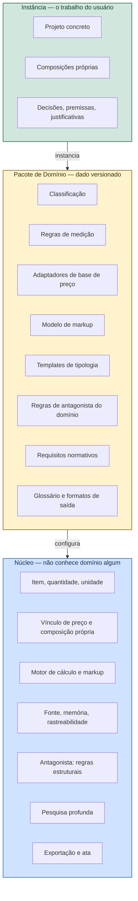

# VÉRTICE — Plataforma e Domínios

**Versão:** 0.2
**Documento-pai:** `VERTICE-decisoes.md` — ADR-018 a ADR-021
**Relacionado:** `VERTICE-modulo-pesquisa.md`, `VERTICE-modelo-universal.md`

---

## 1. Princípio

> **O núcleo não sabe o que é uma obra.**

Enquanto o motor souber o que é alvenaria, BDI ou SINAPI, o produto está preso à construção civil brasileira. A escalabilidade não vem de acrescentar mais grupos à EAP — vem de **remover conhecimento de domínio do núcleo**.

O que sobra no núcleo é o que é verdade em qualquer orçamento, de qualquer área:

```text
item  ×  quantidade  ×  preço unitário   →  custo direto
custo direto  +  indiretos  +  tributos  →  preço
tudo com  origem, memória, fonte e data
```

Nada acima menciona construção. Isso é orçamento de obra, de manutenção industrial, de projeto de software, de safra agrícola, de evento ou de reforma naval.

---

## 2. Três camadas



**Teste do desenho:** remover o pacote de construção civil e instalar um de manutenção industrial não pode exigir uma linha de código no núcleo. Se exigir, o núcleo ainda tem conhecimento de domínio dentro dele.

---

## 3. Pacote de domínio

Um diretório versionado, assinado, instalável. Sem código executável — dado declarativo e templates.

```yaml
dominio: civil-construction-br
versao: 1.4.0
idioma: pt-BR
descricao: Orçamento de obras de edificação e reforma no Brasil

unidades: [m, m2, m3, kg, un, h, vb, mes, dia, t, l]

classificacao:
  padrao: ABNT-NBR-15965
  eixos: [resultado, espaco]
  arquivo: classification/nbr15965.yaml

bases_preco:
  - adaptador: sinapi-xlsx
    rotulo: SINAPI
    oficial: true
    regimes: [ONERADO, DESONERADO, SEM_ENCARGOS]
    granularidade_geografica: UF
  - adaptador: tabela-propria-csv
    rotulo: Tabela do escritório
    oficial: false

regras_medicao: regras/*.yaml

markup:
  modelo: bdi-analitico-br
  parcelas: [administracao_central, seguro_garantia, risco,
             despesas_financeiras, lucro]
  tributos_sobre_faturamento: [pis, cofins, iss, cprb]
  formula: "((1+AC+SG+R)*(1+DF)*(1+L))/(1-(PIS+COFINS+ISS+CPRB))-1"
  referencias_externas: [tcu-acordao-2622-2013]

custos_fora_do_markup:
  - grupo: taxas_licencas
    rotulo: Taxas, licenças e responsabilidade técnica

tipologias: tipologias/*.yaml

antagonista:
  regras: antagonist/*.yaml

pesquisa:
  perfis: pesquisa/perfis.yaml
```

### 3.1 O que o pacote pode e não pode

| Pode | Não pode |
|------|----------|
| Declarar classificação, unidades e regras de medição | Conter código executável |
| Declarar fórmula de markup como expressão | Alterar o motor de cálculo |
| Registrar adaptadores de base por nome | Implementar o adaptador |
| Acrescentar regras ao antagonista | Desligar regra estrutural do núcleo |
| Definir formatos e rótulos de saída | Alterar o formato da ata de objeções |

A última linha das duas colunas é a mais importante: **pacote de domínio não desliga verificação estrutural**. Se pudesse, o primeiro pacote mal escrito silenciaria o antagonista.

---

## 4. Decisões

### ADR-018 — Adaptador de base de preço

**Contexto.** O importador atual entende um formato: o pacote SINAPI. Já existem pelo menos quatro casos concretos — SINAPI, SICRO, tabela própria do escritório e tabela de mercado — e domínios fora da construção trarão outros.

**Decisão.** Interface de adaptador com quatro operações: identificar, validar, importar, normalizar.

**Por que aqui a abstração se justifica e na ADR-006 não.** Lá havia um provedor de IA concreto e três hipotéticos: a interface seria adivinhação sobre o que varia. Aqui existem quatro formatos reais, com diferenças já conhecidas — periodicidade, granularidade geográfica, regime, presença de composição analítica. A forma da variação é observada, não suposta.

O critério permanece o mesmo: **abstração nasce do segundo caso concreto, nunca do primeiro**.

**Consequência.** O importador SINAPI vira `AdaptadorSinapiXlsx`, uma implementação entre outras. As validações V1–V6 sobem para o contrato do adaptador, porque valem para qualquer base.

### ADR-019 — Markup generalizado

**Contexto.** BDI é um modelo de markup específico do Brasil, com tributos que dividem em vez de somar.

**Decisão.** O núcleo conhece "modelo de markup": um conjunto de parcelas nomeadas, uma expressão e uma lista de tributos sobre faturamento. BDI é uma instância declarada no pacote.

**Consequência.** Domínio com margem simples sobre custo, com cost-plus ou com margem sobre preço de venda usa o mesmo motor, declarando expressão diferente. As regras `A-BDI-*` do antagonista migram para o pacote de construção civil.

### ADR-020 — Composição própria é conceito do núcleo

**Contexto.** A CPU nasceu como resposta à ausência de SINAPI aderente.

**Decisão.** O conceito sobe para o núcleo com nome neutro — **composição própria** — porque o problema é universal: toda base de referência tem lacuna. Os três gatilhos generalizam sem perda: item ausente da base, item presente mas não equivalente, item presente e equivalente mas sem preço na granularidade adotada.

**Consequência.** O portão de permissão, a trava anti-duplicidade e a exigência de fonte valem em qualquer domínio. Só o vocabulário vem do pacote.

### ADR-021 — Pesquisa profunda como serviço do núcleo

**Contexto.** Nenhuma base de referência cobre tudo, em domínio nenhum.

**Decisão.** O núcleo oferece pesquisa profunda como serviço; o pacote de domínio declara **perfis de pesquisa** — o que procurar, onde, em quais idiomas, com que critério de confiabilidade. Detalhado em `VERTICE-modulo-pesquisa.md`.

**Consequência.** A pesquisa nunca substitui base oficial. Ela atua onde a base não responde. Essa fronteira é do núcleo e o pacote não a move.

---

## 5. O núcleo em detalhe

O que **nunca** muda entre domínios:

| Conceito | Definição neutra |
|----------|------------------|
| Projeto | Aquilo que está sendo orçado |
| Espaço | Onde o item se localiza — pavimento, linha de produção, setor, talhão, sprint |
| Item | Unidade orçável, com classificação, quantidade e unidade |
| Quantidade | Valor com origem obrigatória e memória legível |
| Vínculo de preço | Base de referência, composição própria ou pendente |
| Composição própria | Preço montado a partir de componentes, cada um com fonte |
| Fonte | Origem verificável, com data e confiabilidade |
| Markup | Transformação de custo direto em preço |
| Pendência | Item sem base técnica, fora do total, com responsável |
| Objeção | Defeito especificado pelo antagonista |
| Cenário | Variação calculada pelo mesmo motor do oficial |
| Dossiê | Resultado da pesquisa profunda, com citações |

### 5.1 Regras estruturais do antagonista

Ficam no núcleo, valem em qualquer domínio e nenhum pacote as remove:

`A-EST-*` integridade · `A-DUP-*` duplicidade · `A-FON-*` rastreabilidade · `A-PEN-*` pendências · `A-QNT-01` quantidade sem origem · `A-CPR-*` composição própria

As específicas — `A-BDI-*`, `A-AL-*`, `A-SIN-*`, `A-RES-*` — descem para o pacote de construção civil.

---

## 6. O modelo em outras áreas

Prova de que o núcleo é neutro. Nenhuma linha de código muda entre as colunas.

| Conceito do núcleo | Construção civil | Manutenção industrial | Infraestrutura de TI | Agronegócio |
|--------------------|------------------|----------------------|---------------------|-------------|
| Base de referência | SINAPI | Tabela de horas e sobressalentes | Tabela de licenças e nuvem | Coeficientes técnicos por cultura |
| Classificação | NBR 15965 | Taxonomia de ativos | Camadas de arquitetura | Fases do ciclo da cultura |
| Espaço | Pavimento, ambiente | Linha, equipamento, TAG | Ambiente, região | Talhão, gleba |
| Regra de medição | Área de parede menos vãos | Horas por parada programada | Instâncias por carga | Insumo por hectare |
| Composição própria | CPU | Serviço especializado sem tabela | Serviço gerenciado sem catálogo | Prática sem coeficiente publicado |
| Markup | BDI analítico | Margem sobre custo | Margem sobre valor de contrato | Margem sobre saca |
| Fora do markup | Taxas e ART | Taxas de certificação | Impostos sobre software | Frete e armazenagem |
| Pendência | Projeto executivo ausente | Escopo dependente de inspeção | Requisito não definido | Área não mapeada |

Se uma linha dessa tabela exigir alteração no núcleo, o núcleo está errado — não a linha.

---

## 7. Ciclo de vida do pacote

- **Versionamento semântico.** Maior muda estrutura de classificação; menor acrescenta regras; correção ajusta dado.
- **Projeto fixa a versão.** Orçamento aprovado não muda porque o pacote foi atualizado. Migrar é ato explícito, com comparativo.
- **Assinatura.** Pacote de terceiro é verificado antes de instalar: ele carrega critérios de medição que viram número no orçamento assinado.
- **Compatibilidade declarada.** O manifesto informa a faixa de versões de núcleo com que funciona.
- **Instalação sem reinício.** Pacote é dado; instalar não recompila nada.

---

## 8. Impacto no roadmap

| Fase | Ajuste |
|------|--------|
| **F0** | Nasce com a separação núcleo/pacote. Retrofit depois custaria caro |
| **F1** | Entrega o núcleo mais o pacote `civil-construction-br` v1. O produto vendido segue sendo de construção |
| **F2** | Regras de medição e ambiente vêm do pacote, não do código |
| **F2b** | IFC é adaptador de entrada geométrica, ao lado de DWG |
| **F4** | Segundo pacote de domínio como prova de neutralidade — candidato natural: manutenção industrial, que compartilha o vocabulário de engenharia |

**A F1 não atrasa por causa disso.** A separação é de organização, não de funcionalidade: o pacote v1 nasce com exatamente o que a F1 precisaria de qualquer forma. O que muda é onde a informação mora.

---

## 9. Testes de aceite

| # | Cenário | Esperado |
|---|---------|----------|
| L01 | Buscar por "alvenaria", "BDI" ou "SINAPI" no código do núcleo | Nenhuma ocorrência fora de teste |
| L02 | Desinstalar o pacote de construção civil | Núcleo sobe e abre projeto vazio sem erro |
| L03 | Instalar pacote de domínio fictício mínimo | Orçamento completo criado, calculado e exportado |
| L04 | Pacote tentando desligar regra estrutural do antagonista | Rejeitado na instalação |
| L05 | Pacote com código executável | Rejeitado na instalação |
| L06 | Dois pacotes instalados simultaneamente | Projetos independentes, sem vazamento entre eles |
| L07 | Atualizar pacote com projeto aprovado aberto | Projeto mantém a versão fixada |
| L08 | Markup de margem simples declarado em pacote | Motor calcula sem alteração de código |
| L09 | Adaptador de base em CSV | Mesmas validações V1–V6 do adaptador SINAPI |
| L10 | Pacote sem assinatura válida | Instalação recusada com motivo |

---

## 10. Histórico

| Versão | Data | Alteração |
|--------|------|-----------|
| 0.2 | 13/09/2026 | Caminhos de exemplo (`classification/`, `antagonist/`) atualizados para inglês, acompanhando o rename retroativo de arquivos e pastas do código |
| 0.1 | 13/09/2026 | Documento inicial. Separação núcleo, pacote de domínio e instância. ADR-018 a ADR-021. Conhecimento de construção civil removido do núcleo |
