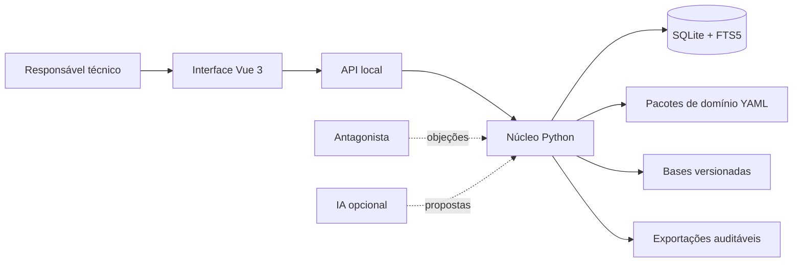
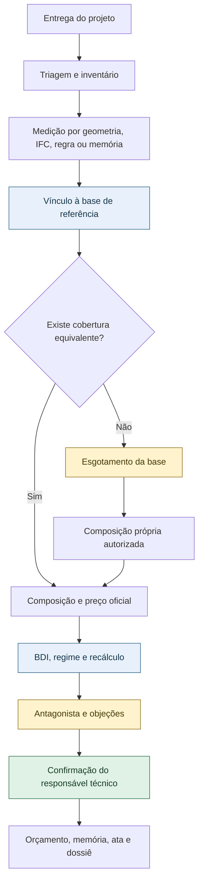
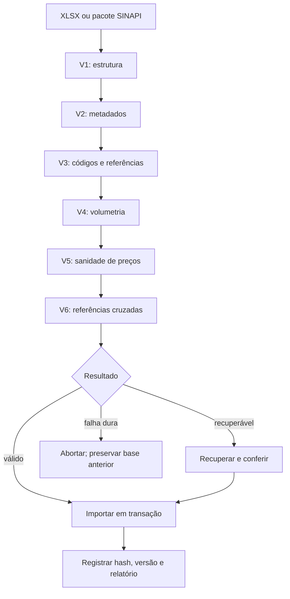
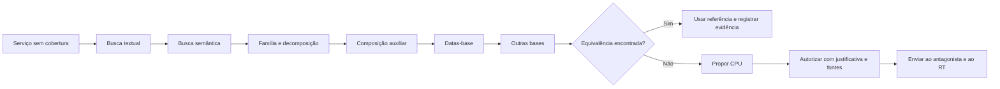
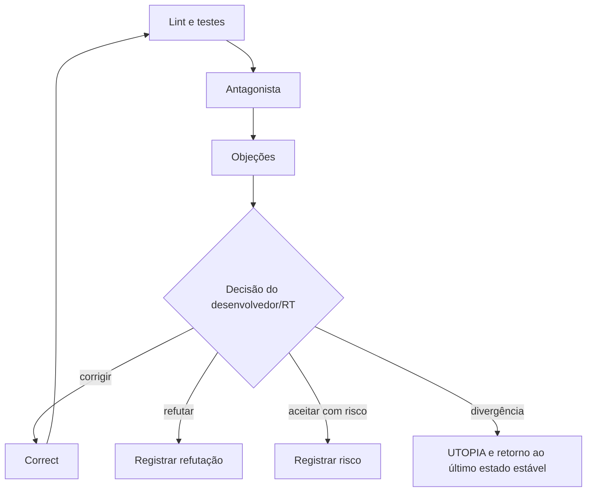

# VÉRTICE

Motor local e offline-first para elaboração de orçamentos técnicos auditáveis na construção civil brasileira.

O VÉRTICE transforma documentos, modelos, bases de referência e decisões técnicas em um orçamento rastreável, verificável e exportável. O sistema foi desenhado para manter a responsabilidade técnica humana no centro do processo: automação propõe, evidencia e verifica; o responsável técnico decide.

## Visão geral



## Princípios

- **Proveniência obrigatória:** nenhum número chega ao total sem uma origem resolvível.
- **Núcleo neutro:** conceitos específicos de SINAPI, BDI e construção civil pertencem aos pacotes de domínio.
- **Offline-first:** o fluxo principal não depende de rede nem de IA.
- **Base oficial prevalente:** uma fonte oficial coberta não é substituída por pesquisa externa.
- **Verificação independente:** o antagonista questiona premissas, fontes, unidades e cálculos.
- **Decisão humana:** o responsável técnico confirma propostas, achados e exceções relevantes.
- **Imutabilidade auditável:** orçamento, versão da base e hashes usados permanecem vinculados ao resultado.

## Fluxo principal



## Arquitetura

```text
VÉRTICE/
├── core/                       # Núcleo Python: domínio, API e serviços
│   ├── api/                    # Servidor local e rotas HTTP
│   ├── domain/                 # Tipos e invariantes neutros
│   ├── documents/              # Leitura e triagem de documentos
│   ├── packages/               # Carregamento e validação de pacotes
│   ├── pricing/                # BDI, orçamento e persistência
│   └── reference_base/         # Busca, explosão e adaptador SINAPI
├── src/                        # Interface Vue 3 + TypeScript + Vite
├── packages/                   # Pacotes declarativos de domínio
├── tests/                      # Testes automatizados Python
├── tools/                      # Linters e verificadores do projeto
├── docs/                       # Especificações, decisões e regras
├── data/                       # Bases, exemplos e arquivos de entrada
├── public/                     # Recursos públicos da aplicação
├── index.html                  # Entrada do frontend
├── pyproject.toml              # Configuração Python
└── package.json                # Scripts e dependências frontend
```

O shell Tauri 2, o índice vetorial local e algumas integrações avançadas estão previstos na arquitetura, mas não fazem parte do empacotamento atual.

## Componentes

| Componente | Responsabilidade |
| --- | --- |
| `core/domain` | Quantias, origens, marcações e invariantes de domínio |
| `core/documents` | Leitura offline, extração e triagem de documentos |
| `core/reference_base` | Importação, validação, busca e explosão de bases |
| `core/pricing` | Orçamento, persistência, regime e BDI |
| `core/packages` | Pacotes YAML sem código executável |
| `core/api` | Sidecar HTTP local em `127.0.0.1:8756` |
| `src` | Busca, orçamento e interação do usuário |
| `tools` | Lint de domínio, esquema e Markdown |

## Requisitos

- Python 3.12 ou superior
- Node.js com npm
- Dependências Python declaradas em `pyproject.toml`
- Dependências frontend declaradas em `package.json`

## Instalação

```bash
python -m venv .venv
```

Ative o ambiente virtual:

```bash
# Windows PowerShell
.venv\Scripts\Activate.ps1

# Linux/macOS
source .venv/bin/activate
```

Instale as dependências:

```bash
python -m pip install --upgrade pip
python -m pip install -e ".[cad,pdf,docx,planilha]"
npm ci
```

Os extras são opcionais e habilitam leitura CAD, PDF, DOCX e planilhas.

## Execução local

Inicie o sidecar Python:

```bash
VERTICE_DB_PATH=./data/vertice.db python -m core.api.server
```

No Windows PowerShell:

```powershell
$env:VERTICE_DB_PATH = ".\data\vertice.db"
python -m core.api.server
```

Em outro terminal, inicie a interface:

```bash
npm run dev
```

O sidecar escuta por padrão em `http://127.0.0.1:8756` e o Vite disponibiliza a interface em `http://localhost:5173`.

## Pipelines

### Importação SINAPI



### Composição própria



Uma CPU só pode ser criada após o esgotamento documentado da base. Recusas permanecem como pendências e não são incluídas no total.

### Verificação e correção



## Regras de cálculo

O BDI analítico segue a fórmula:

```text
BDI = ((1 + AC + SG + R) * (1 + DF) * (1 + L))
      / (1 - (PIS + COFINS + ISS + CPRB)) - 1
```

O modelo CME de referência possui BDI de `23,6245%`, composto por AC, SG, R, DF, L, PIS, COFINS, ISS e CPRB. Os valores detalhados estão documentados em `docs/VERTICE-modulo-precificacao.md` e na planilha de exemplo em `data/examples/`.

Regras essenciais:

- Valores monetários usam `Decimal` e centavos inteiros na persistência.
- Quantidades, coeficientes, percentuais e geometrias persistem como texto decimal.
- O regime (`ONERADO`, `DESONERADO` ou `SEM_ENCARGOS`) é obrigatório.
- Troca de regime exige recálculo e comparativo.
- Administração local é mensurável e fica fora do BDI.
- Taxas não confirmadas são informativas e não entram no total.
- Pendências nunca são estimadas silenciosamente.

## API

Rotas principais:

| Método | Rota | Finalidade |
| --- | --- | --- |
| `GET` | `/sinapi/buscar` | Buscar itens na base de referência |
| `GET` | `/sinapi/composicao/{codigo}/explodir` | Explodir uma composição |
| `POST` | `/orcamento` | Criar orçamento |
| `GET` | `/orcamento/{id}` | Consultar orçamento |
| `POST` | `/orcamento/{id}/bdi` | Calcular e persistir BDI |
| `GET` | `/orcamento/{id}/bdi` | Consultar BDI do orçamento |

## Qualidade

```bash
python -m pytest
npx vue-tsc --noEmit
python tools/domain_lint.py
python tools/schema_lint.py --docs docs
python tools/markdown_lint.py docs
```

O build de produção do frontend é executado com:

```bash
npm run build
```

## Segurança e auditoria

- O sidecar deve operar somente em `127.0.0.1`.
- A comunicação frontend-sidecar usa token de sessão.
- O modo sem IA não envia dados para serviços externos.
- Informações identificáveis do cliente devem ser filtradas antes de qualquer pesquisa externa.
- Chaves de provedores devem ser armazenadas no gerenciador de credenciais do sistema.
- Bases e documentos devem ter hash e cadeia de proveniência.
- O antagonista possui comportamento somente leitura.
- Backups SQLite devem ser restaurados e verificados periodicamente.

## Estado atual e limitações

O núcleo de domínio, API local, frontend, importação SINAPI, precificação, testes e ferramentas de lint estão presentes no repositório. Tauri, IFC/CAD completo, pesquisa profunda com IA, classificação avançada, exportações especializadas e módulos financeiros adicionais permanecem em evolução.

O VÉRTICE não substitui laudo, orçamento ou responsabilidade de profissional habilitado. A aplicação não fecha automaticamente itens sem cobertura, não inventa quantitativos e não interpreta sozinha o enquadramento jurídico da desoneração.

## Roadmap

1. Consolidar o shell desktop Tauri e o ciclo de vida do sidecar.
2. Expandir CAD/IFC, ambientes fechados e dedução geométrica.
3. Integrar embeddings locais e classificação de camadas.
4. Implementar recálculo incremental, cronograma financeiro, biblioteca de CPUs e análise de sensibilidade.
5. Adicionar segundo domínio configurável por pacote.

## Documentação

O índice completo está em [`docs/INDICE.md`](docs/INDICE.md). A precedência documental é:

```text
REGRAS > decisões ADR > arquitetura > documentos de módulo
```

Documentos de referência:

- [`docs/VERTICE-fundamentos.md`](docs/VERTICE-fundamentos.md)
- [`docs/VERTICE-arquitetura.md`](docs/VERTICE-arquitetura.md)
- [`docs/VERTICE-plataforma.md`](docs/VERTICE-plataforma.md)
- [`docs/VERTICE-modelo-universal.md`](docs/VERTICE-modelo-universal.md)
- [`docs/VERTICE-modulo-sinapi.md`](docs/VERTICE-modulo-sinapi.md)
- [`docs/VERTICE-modulo-precificacao.md`](docs/VERTICE-modulo-precificacao.md)
- [`docs/VERTICE-modulo-cpu.md`](docs/VERTICE-modulo-cpu.md)
- [`docs/VERTICE-modulo-pesquisa.md`](docs/VERTICE-modulo-pesquisa.md)
- [`docs/VERTICE-modulo-exportacao.md`](docs/VERTICE-modulo-exportacao.md)
- [`docs/VERTICE-agente-antagonista.md`](docs/VERTICE-agente-antagonista.md)
- [`docs/VERTICE-modulo-correct.md`](docs/VERTICE-modulo-correct.md)
- [`docs/VERTICE-LINT-SUITE.md`](docs/VERTICE-LINT-SUITE.md)
- [`docs/VERTICE-REGRAS.md`](docs/VERTICE-REGRAS.md)

## Licença

Projeto proprietário. Consulte as regras e decisões em [`docs/VERTICE-REGRAS.md`](docs/VERTICE-REGRAS.md) antes de distribuir ou alterar o sistema.
